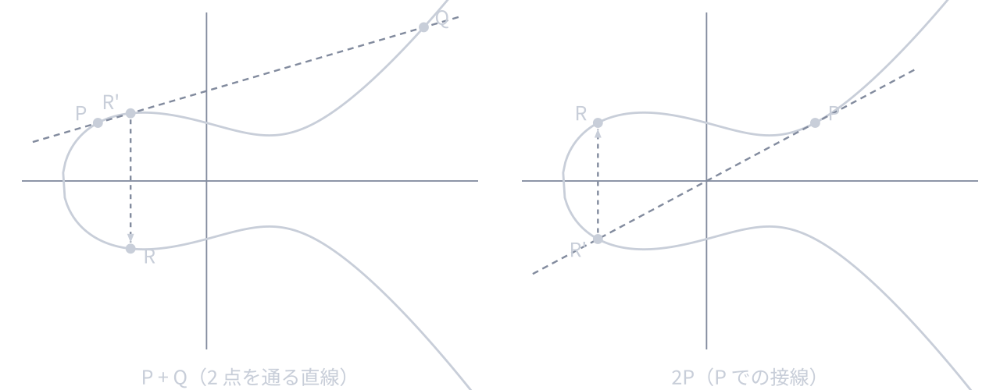
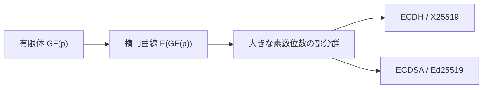

[前回](/blog/2026/crypto_1)では，暗号学の基盤となる抽象代数学の基礎を扱いました．
本稿では，現代暗号で広く使われる **楕円曲線** を扱います．楕円曲線暗号 (ECC) は，RSA より短い鍵で同等の安全性を実現でき，TLS 1.3 や SSH で使われています．

シリーズ目次

1. [抽象代数学の基礎](/blog/2026/crypto_1)
2. **楕円曲線** (本稿)
3. [DH 鍵共有，ECDH 鍵共有](/blog/2026/crypto_3)
4. [共通鍵暗号 (AES など)](/blog/2026/crypto_4)
5. [公開鍵暗号 (RSA, ECC など)](/blog/2026/crypto_5)
6. TLS
7. (余談) SSH

## なぜ楕円曲線なのか

前回の最後で，離散対数問題 (DLP) が暗号の安全性の根拠になると説明しました．$\mathrm{GF}(p)$ 上の DLP でも暗号は構成できますが，十分な安全性を得るには 2048 ビット以上の素数が必要です．

一方，楕円曲線上の離散対数問題 (ECDLP) は，同じ安全性を 256 ビット程度の鍵で実現できます．
これは，ECDLP に対しては数体篩法のような準指数時間アルゴリズムが知られていないためです．

| 安全性レベル | RSA/DH 鍵長  |  ECC 鍵長  |
| :----------: | :----------: | :--------: |
|  128 ビット  | 3072 ビット  | 256 ビット |
|  192 ビット  | 7680 ビット  | 384 ビット |
|  256 ビット  | 15360 ビット | 512 ビット |

([NIST SP 800-57 Part 1 Rev.5](https://csrc.nist.gov/pubs/sp/800/57/pt1/r5/final) Table 2)

鍵が短いということは，計算量もメモリも通信帯域も節約できるということです．
DNS の TXT レコードに公開鍵を入れるような用途では，短い鍵は大きなメリットになります．

☕ コラム: なぜ「楕円」曲線なのか

「楕円曲線」という名前から楕円を思い浮かべるかもしれませんが，楕円曲線の形は楕円ではありません．

この名前は，楕円の弧長を計算する楕円積分に由来しています．楕円積分を逆関数として捉えた楕円関数の研究の中で，その代数的構造として楕円曲線が登場しました．つまり「楕円の研究の過程で生まれた曲線」であって「楕円の形をした曲線」ではないのです．

暗号に応用されるようになったのは 1985 年のことで，Neal Koblitz と Victor Miller がそれぞれ独立に楕円曲線暗号を提案しました．

## 楕円曲線の定義

### ワイエルシュトラス方程式

体 $K$ 上の **楕円曲線** $E$ は，以下の方程式で定義される曲線です．

$$
y^2 = x^3 + ax + b
$$

ここで $a, b \in K$ であり，$4a^3 + 27b^2 \neq 0$ (非特異条件) を満たす必要があります．
本稿では，暗号実装でよく使う標数 $p > 3$ の素数体を前提に，この短いワイエルシュトラス形を使います．

この条件は，曲線が **特異点** (尖点や自己交差) を持たないことを保証します．特異点がある曲線では，後述する群構造がうまく定義できません．

### 実数上での楕円曲線

実数体 $\mathbb{R}$ 上で楕円曲線がどのような形をしているか，いくつかの例を見てみましょう．

- $y^2 = x^3 - x + 1$($a = -1, b = 1$): なめらかな 1 つの連結成分
- $y^2 = x^3 - 3x + 3$($a = -3, b = 3$): 同様に 1 つの連結成分
- $y^2 = x^3 - x$($a = -1, b = 0$): 2 つの連結成分 (卵型の閉曲線と無限に伸びる曲線)

実数上のグラフは $x$ 軸に関して対称です．これは方程式の $y^2$ から明らかで，$(x, y)$ が曲線上の点なら $(x, -y)$ も曲線上の点です．

## 楕円曲線上の点の加法

楕円曲線の最も重要な性質は，曲線上の点に **加法** を定義でき，その加法に関して **群** をなすことです．

### 無限遠点

楕円曲線の群には，通常の座標では表せない特別な点 $\mathcal{O}$ (無限遠点) を加えます．
$\mathcal{O}$ は群の **単位元** の役割を果たします．

### 幾何学的な定義 (実数上)

楕円曲線上の 2 点 $P, Q$ の和 $R = P + Q$ は，以下のように幾何学的に定義されます．

1. $P$ と $Q$ を通る直線を引く
2. この直線と楕円曲線の第 3 の交点 $R'$ を求める
3. $R'$ を $x$ 軸に関して反転した点が $R = P + Q$

**$P = Q$ の場合** (点の 2 倍算: $2P = P + P$) は，$P$ における楕円曲線の接線を使い，同じ手順を踏みます．

**$P$ と $-P$ の場合** ($P$ と $x$ 軸に関して対称な点) は，直線は垂直になり第 3 の交点が存在しないため，$P + (-P) = \mathcal{O}$ (無限遠点) と定義します．

点の加法は [Andrea Corbellini のインタラクティブな図解](https://andrea.corbellini.name/ecc/interactive/reals-add.html) で動かすと直感的につかめます．

### 代数的な公式

有限体上での実際の計算には，以下の代数的な公式を使います．

$P = (x_1, y_1),\ Q = (x_2, y_2)$ で $P \neq \pm Q$ のときは，次の通りです．

$$
\lambda = \frac{y_2 - y_1}{x_2 - x_1}, \quad x_3 = \lambda^2 - x_1 - x_2, \quad y_3 = \lambda(x_1 - x_3) - y_1
$$

$P + Q = (x_3, y_3)$ です．

$P = Q$ のとき (2 倍算) は，次の通りです．

$$
\lambda = \frac{3x_1^2 + a}{2y_1}, \quad x_3 = \lambda^2 - 2x_1, \quad y_3 = \lambda(x_1 - x_3) - y_1
$$

$2P = (x_3, y_3)$ です．

ここでの除算は，有限体 $\mathrm{GF}(p)$ 上では **モジュロ逆元** を使って計算します ([前回](/blog/2026/crypto_1) の拡張ユークリッドの互除法)．

### 群の性質

楕円曲線上の点の集合 $E(K)$ は，上記の加法に関して **アーベル群** をなします．

- 単位元: 無限遠点 $\mathcal{O}$
- 逆元: 点 $P = (x, y)$ の逆元は $-P = (x, -y)$
- 結合法則・可換法則も成立 (証明は省略)

## 有限体上の楕円曲線

暗号で使う楕円曲線は，実数上ではなく **有限体 $\mathrm{GF}(p)$** 上で定義されます．

### $\mathrm{GF}(p)$ 上の楕円曲線

素数 $p$ に対して，$\mathrm{GF}(p)$ 上の楕円曲線 $E$ は，次の合同式を満たす点の集合として定義します．

$$
y^2 \equiv x^3 + ax + b \pmod{p}
$$

を満たす点 $(x, y)$ の集合 (と無限遠点 $\mathcal{O}$) です．

実数上のような「なめらかな曲線」ではなく，**離散的な点の集合** になります．

### 例: $\mathrm{GF}(23)$ 上の楕円曲線

$E: y^2 \equiv x^3 + x + 1 \pmod{23}$ を考えてみましょう ($a = 1, b = 1$)．

各 $x \in \{0, 1, \ldots, 22\}$ に対して $x^3 + x + 1 \bmod 23$ を計算し，それが $\mathrm{GF}(23)$ で平方数かどうかを確認します．

- $x = 0$: $0 + 0 + 1 = 1,\ y^2 \equiv 1$ → $y = 1, 22$ → 点 $(0, 1),\ (0, 22)$
- $x = 1$: $1 + 1 + 1 = 3,\ y^2 \equiv 3$ → $y = 7, 16$ → 点 $(1, 7),\ (1, 16)$
- $x = 2$: $8 + 2 + 1 = 11,\ y^2 \equiv 11$ → 平方数でない → 点なし
- $x = 5$: $125 + 5 + 1 = 131 \equiv 16,\ y^2 \equiv 16$ → $y = 4, 19$ → 点 $(5, 4),\ (5, 19)$

このように，すべての $x$ を走査して点を列挙します．無限遠点 $\mathcal{O}$ を含めて，この曲線上には **28 個** の点が存在します (群の位数が 28)．

### 群の位数

有限体 $\mathrm{GF}(p)$ 上の楕円曲線 $E$ の点の個数 $\#E(\mathrm{GF}(p))$ は，**ハッセの定理** により以下の範囲に収まります．

$$
p + 1 - 2\sqrt{p} \leq \#E(\mathrm{GF}(p)) \leq p + 1 + 2\sqrt{p}
$$

つまり，点の個数は $p$ に近い値になります．

ただし，実際の暗号では楕円曲線上の全点をそのまま使うのではなく，その中の **大きな素数位数の部分群** と，その生成元となる基点 $G$ を選んで使います．
第 3 章の ECDH で出てくる $G$ は，この基点です．

実際に暗号へ繋がる流れを図にすると，次のようになります．

## スカラー倍

楕円曲線上の点 $P$ に対して，整数 $n$ によるスカラー倍 $nP$ は，$P$ を $n$ 回加算することです．

- $1 \cdot P = P$
- $2P = P + P$
- $3P = P + P + P = 2P + P$
- $\vdots$
- $nP = \underbrace{P + P + \cdots + P}_{n}$

### 繰り返し二乗法

スカラー倍を効率的に計算するために，繰り返し二乗法を使います．これは整数のべき乗における繰り返し二乗法の楕円曲線版です．

$n$ を 2 進展開して $n = (b_k\ b_{k-1}\ \cdots\ b_1\ b_0)_2$ と表したとき，手順は次の通りです．

1. $R \leftarrow \mathcal{O}$ (無限遠点)
2. $i = k$ から $0$ まで繰り返し:
   - $R \leftarrow 2R$(2 倍算)
   - $b_i = 1$ なら $R \leftarrow R + P$ (加算)
3. $R$ が $nP$

このアルゴリズムにより，$O(\log n)$ 回の演算で $nP$ を計算できます．

## ECDLP (楕円曲線上の離散対数問題)

### 定義

楕円曲線 $E$ 上の点 $P$ (生成元) と点 $Q$ が与えられたとき，次を考えます．

$$
Q = nP
$$

を満たす整数 $n$ を求める問題を **楕円曲線上の離散対数問題 (ECDLP)** と呼びます．

### 一方向性

[前回](/blog/2026/crypto_1)の DLP と同様に，一方向性があります．

- **スカラー倍の計算は容易**: $n$ と $P$ から $Q = nP$ を $O(\log n)$ で計算可能
- **逆方向は困難**: $Q$ と $P$ から $n$ を求める効率的なアルゴリズムは知られていない

$\mathrm{GF}(p)$ 上の DLP と異なり，ECDLP に対しては **数体篩法に相当する準指数時間アルゴリズムが存在しない** ことが，楕円曲線暗号がより短い鍵で高い安全性を実現できる理由です．

現在知られている最良のアルゴリズムは Pollard の $\rho$ 法で，計算量は $O(\sqrt{n})$ です．

## 標準的な楕円曲線

暗号に使う楕円曲線は，安全性が十分に検証された標準曲線を使用します．自分で曲線を選ぶと，意図せず弱い曲線を選んでしまうリスクがあります．

### P-256 (secp256r1 / prime256v1)

[NIST が標準化](https://csrc.nist.gov/pubs/sp/800/186/final)した楕円曲線で，最も広く使われています．

- 体: $\mathrm{GF}(p)$，$p = 2^{256} - 2^{224} + 2^{192} + 2^{96} - 1$(256 ビット素数)
- 方程式: $y^2 = x^3 - 3x + b$($b$ は特定の値)
- 安全性: 128 ビットセキュリティ
- 用途: TLS, X.509 証明書, WebAuthn の ES256 など

### Curve25519 / X25519

Daniel J. Bernstein が 2006 年に提案した楕円曲線で，鍵共有では **X25519** として広く使われています．

- 体: $\mathrm{GF}(p)$，$p = 2^{255} - 19$ (この素数が名前の由来)
- 方程式: $y^2 = x^3 + 486662x^2 + x$ (モンゴメリ形式)
- 安全性: 約 128 ビットセキュリティ
- 用途: X25519 として TLS 1.3, SSH, Signal プロトコル, WireGuard

### Ed25519

Curve25519 と同じ有限体 $\mathrm{GF}(2^{255} - 19)$ 上のツイスト・エドワーズ曲線で，**デジタル署名** に特化した形式です．
名前は似ていますが，X25519 は鍵共有，Ed25519 は署名と，用途を分けて覚えると混乱しにくいです．

- 署名アルゴリズム: EdDSA (Edwards-curve Digital Signature Algorithm)
- SSH の `ssh-ed25519` として広く使われている

現在は ssh-keygen で発行されるデフォルトのアルゴリズムも Ed25519 になっています．

---
#### 参考文献

- [NIST SP 800-186: Recommendations for Discrete Logarithm-based Cryptography: Elliptic Curve Domain Parameters](https://csrc.nist.gov/pubs/sp/800/186/final)
- [SEC 2: Recommended Elliptic Curve Domain Parameters](https://www.secg.org/sec2-v2.pdf) — SECG による標準曲線パラメータ
- [RFC 7748: Elliptic Curves for Security](https://datatracker.ietf.org/doc/html/rfc7748) — X25519, X448 の仕様
