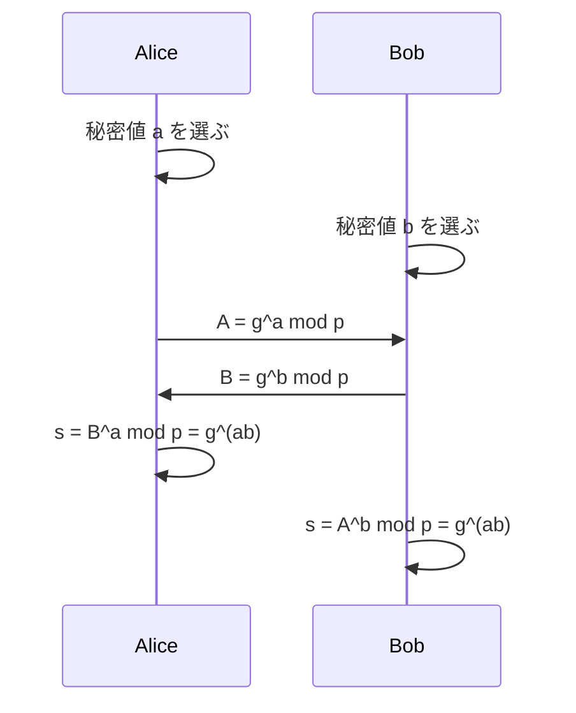
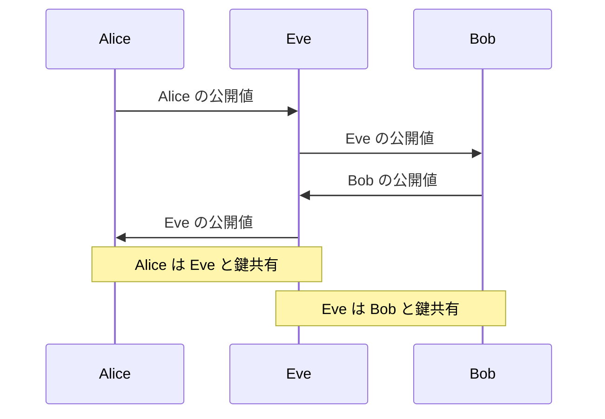

[前回](/blog/2026/crypto_2)では，楕円曲線の数学的な構造を解説しました．
本稿では，その構造を応用した **DH 鍵共有** と **ECDH 鍵共有** を扱います．ブラウザが HTTPS でサーバと通信するときも，まずはこの系統の仕組みで共有秘密を作っています．

シリーズ目次

1. [抽象代数学の基礎](/blog/2026/crypto_1)
2. [楕円曲線](/blog/2026/crypto_2)
3. **DH 鍵共有，ECDH 鍵共有** (本稿)
4. [共通鍵暗号 (AES など)](/blog/2026/crypto_4)
5. [公開鍵暗号 (RSA, ECC など)](/blog/2026/crypto_5)
6. TLS
7. (余談) SSH

## 鍵共有問題とは

暗号通信には **共通の秘密鍵** が必要です (詳細は次回の共通鍵暗号で解説します)．
しかし，通信路は盗聴される可能性があります．秘密鍵をそのまま通信路に流すことはできません．

この「事前に秘密を共有していない 2 者が，盗聴者のいる通信路を通じて共通の秘密を確立する」という問題が **鍵共有問題** です．

1976 年に Whitfield Diffie と Martin Hellman がこの問題に対する画期的な解決策を発表しました．

## Diffie-Hellman (DH) 鍵共有

### 前提

[第 1 章](/blog/2026/crypto_1)で解説した以下の要素を使います．

- 大きな素数 $p$
- $\mathrm{GF}(p)^*$ の生成元 $g$
- **離散対数問題 (DLP) の困難性**

$p$ と $g$ は公開パラメータであり，盗聴者も知っている前提です．

### プロトコル

Alice と Bob が共通の秘密鍵を共有する手順は以下の通りです．

**1. 秘密の値を選ぶ**
- Alice: 秘密の整数 $a$ をランダムに選ぶ ($1 < a < p-1$)
- Bob: 秘密の整数 $b$ をランダムに選ぶ ($1 < b < p-1$)

**2. 公開値を交換する**
- Alice → Bob: $A = g^a \bmod p$ を送信
- Bob → Alice: $B = g^b \bmod p$ を送信

**3. 共通秘密を計算する**
- Alice: $s = B^a \bmod p = (g^b)^a \bmod p = g^{ab} \bmod p$
- Bob: $s = A^b \bmod p = (g^a)^b \bmod p = g^{ab} \bmod p$

両者とも **同じ値 $s = g^{ab} \bmod p$** を得ます．
実際のプロトコルでは，この値をそのまま暗号鍵にするのではなく，なんらかの鍵導出関数 (KDF, Key Derivation Function) に入力して用途別の鍵を導出します．

手順を図にすると，次のようになります．

### なぜ安全なのか

盗聴者 (Eve) は $p, g, A = g^a \bmod p, B = g^b \bmod p$ を知っています．
しかし，共通秘密 $s = g^{ab} \bmod p$ を計算するには $a$ または $b$ を知る必要があります．

$A = g^a \bmod p$ から $a$ を求めることは離散対数問題 (DLP) であり，$p$ が十分大きければ計算困難です．

より正式には，DH 鍵共有の安全性は以下の仮定に基づきます．

- **CDH 仮定 (Computational Diffie-Hellman)**: $g^a$ と $g^b$ が与えられたとき，$g^{ab}$ を計算することは困難
- **DDH 仮定 (Decisional Diffie-Hellman)**: $g^a, g^b, g^c$ が与えられたとき，$g^c$ が $g^{ab}$ であるか否かを判定することは困難

CDH 仮定は DLP の困難性より強い仮定です (DLP が解ければ CDH も解けるため)．とはいえ現状 DLP を経由しない解法は知られておらず，実用上は十分な安全性の根拠になります．

## ECDH 鍵共有

DH 鍵共有の楕円曲線版が **ECDH (Elliptic Curve Diffie-Hellman)** です．[第 2 章](/blog/2026/crypto_2)で解説した楕円曲線の群構造を利用します．

### プロトコル

**公開パラメータ**: 楕円曲線 $E$ と基点 (生成元)$G$，$G$ の位数 $n$．

**1. 秘密の値を選ぶ**
- Alice: 秘密の整数 $a$ をランダムに選ぶ ($1 < a < n$)
- Bob: 秘密の整数 $b$ をランダムに選ぶ ($1 < b < n$)

**2. 公開値を交換する**
- Alice → Bob: 点 $A = aG$ を送信
- Bob → Alice: 点 $B = bG$ を送信

**3. 共通秘密を計算する**
- Alice: $S = aB = a(bG) = abG$
- Bob: $S = bA = b(aG) = abG$

両者とも **同じ点 $S = abG$** を得ます．
こちらも実装では，点そのものを直接アプリケーション鍵にするのではなく，共有秘密から KDF で実際の鍵を導出します．

やっていることの形は DH と同じで，べき乗 $g^a$ がスカラー倍 $aG$ に置き換わっただけだと捉えると理解しやすいです．

### DH との対応関係

|                  DH (GF(p))                  |         ECDH (楕円曲線)         |
| :------------------------------------------: | :-----------------------------: |
|             べき乗 $g^a \bmod p$             |         スカラー倍 $aG$         |
|                     乗法                     |              加法               |
| DLP: $g^x \equiv h \pmod{p}$ の $x$ を求める | ECDLP: $xG = Q$ の $x$ を求める |
|              2048+ ビットの素数              |        256 ビットの曲線         |

数学的な構造は同じですが，楕円曲線版は鍵長が大幅に短くなります．
鍵長が短いと，通信のコストやサイズによる制限に対してメリットが出てきます．

## X25519

**X25519** は，[第 2 章](/blog/2026/crypto_2)で扱った Curve25519 を用いた ECDH 鍵共有の具体的な実装仕様です ([RFC 7748](https://datatracker.ietf.org/doc/html/rfc7748))．

### 特徴

- 入出力は **32 バイトの固定長** のバイト列
- x 座標のみを使う (モンゴメリ・ラダーアルゴリズム)
- **定数時間実装** をしやすいよう設計されており，サイドチャネル攻撃に強い
- TLS 1.3 で `x25519` として利用可能

### 使用例

TLS 1.3 のハンドシェイクにおいて，鍵交換に X25519 が使われる場合の流れは次の通りです．

1. クライアントが 32 バイトの乱数から秘密スカラーを作り，公開鍵 (32 バイト) を ClientHello で送信
2. サーバが同様に秘密スカラーを作り，公開鍵を ServerHello で送信
3. 双方が X25519 関数を使って共有秘密を計算
4. 共有秘密から暗号鍵を導出 (HKDF を使用)

公開鍵本体は双方 32 バイトずつで済み，有限体 DH よりコンパクトに安全な共通秘密を確立できます．

## 前方秘匿性 (Forward Secrecy)

### エフェメラル鍵

DH / ECDH には大きく分けて 2 つの運用方法があります．

- **静的 DH**: 長期間同じ秘密鍵を使い回す
- **エフェメラル DH (DHE / ECDHE)**: セッションごとに新しい秘密鍵を生成する

**エフェメラル** とは「一時的な」という意味で，DHE の E，ECDHE の E はこれを意味します．

### 前方秘匿性とは

**前方秘匿性 (Forward Secrecy, FS)** とは，長期秘密鍵 (サーバの秘密鍵など) が将来漏洩しても，過去のセッションの通信内容が復号されない性質です．

エフェメラル DH/ECDH を使うと，次の性質があります．
- 各セッションの秘密鍵はセッション終了後に破棄される
- 長期秘密鍵が漏洩しても，過去のセッション鍵を復元できない
- → 前方秘匿性が確保される

静的 DH では次のようになります．
- 長期秘密鍵が漏洩すると，過去のすべてのセッションが復号可能
- → 前方秘匿性がない

TLS 1.3 では，従来の静的 RSA 鍵交換のような **前方秘匿性のない鍵共有** は廃止されました．
通常の証明書ベースのハンドシェイクでは，(EC) DHE により前方秘匿性を確保します．

☕ コラム: なぜ前方秘匿性が重要なのか — 実際の事例

前方秘匿性が注目されたのは，2013 年のスノーデンによるリーク以降です．

NSA は大量の暗号化通信を記録・保存しており，将来的にサーバの秘密鍵を入手できれば過去の通信を復号できるという「今は保存し，後で復号する (store now, decrypt later)」戦略を取っていたとされています．

前方秘匿性があれば，たとえ秘密鍵が漏洩しても過去の通信は保護されます．これが TLS 1.3 でエフェメラル鍵交換が必須になった大きな動機のひとつです．

将来的に暗号アルゴリズムの安全性を破るような証明が出てきたり，量子コンピュータの発展で DLP が破られたりする可能性もあります．前方秘匿性は，そういった将来のリスクに対しても過去の通信を守るための重要な性質です．

## 中間者攻撃 (MITM) と認証の必要性

DH / ECDH には重要な弱点があります．それは **中間者攻撃 (Man-in-the-Middle Attack, MITM)** に対する脆弱性です．

### 攻撃の仕組み

1. Alice → Eve (攻撃者)← Bob: Eve が通信を中継
2. Alice は Eve と鍵共有し，Eve は Bob と鍵共有する
3. Alice は Eve と共有した鍵で暗号化し，Eve はそれを復号
4. Eve は内容を読んだ後，Bob と共有した鍵で再暗号化して Bob に送信

Alice と Bob はお互いと直接通信していると思っていますが，実際には Eve がすべてを中継しています．

### 対策: 認証

DH / ECDH 単体には **認証** の仕組みがありません．相手が本当に Alice (または Bob) であることを確認できないのです．

この問題を解決するには，次の仕組みを組み合わせます．
- **デジタル署名** で相手の公開値に署名する (後ほど解説)
- **証明書** で相手の身元を確認する (後ほど解説)

TLS では，サーバの証明書とデジタル署名を使って ECDHE の公開値を認証することで，MITM を防止しています．

---
#### 参考文献

- [RFC 7748: Elliptic Curves for Security](https://datatracker.ietf.org/doc/html/rfc7748) — X25519, X448 の仕様
- [RFC 2631: Diffie-Hellman Key Agreement Method](https://datatracker.ietf.org/doc/html/rfc2631) — DH 鍵共有の RFC
- [NIST SP 800-56A Rev.3: Recommendation for Pair-Wise Key-Establishment Schemes Using Discrete Logarithm Cryptography](https://csrc.nist.gov/pubs/sp/800/56a/r3/final)
- [RFC 8446: The Transport Layer Security (TLS) Protocol Version 1.3](https://datatracker.ietf.org/doc/html/rfc8446) — TLS 1.3 での ECDHE の使用
