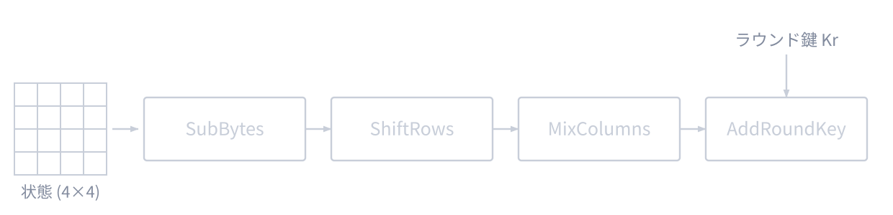
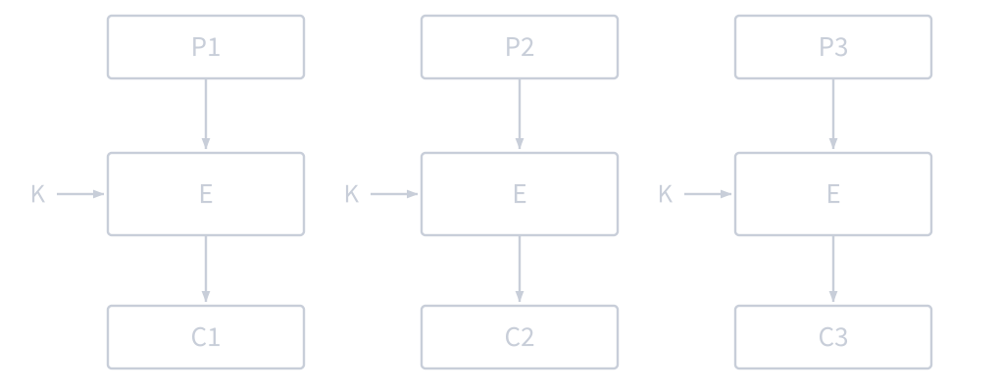
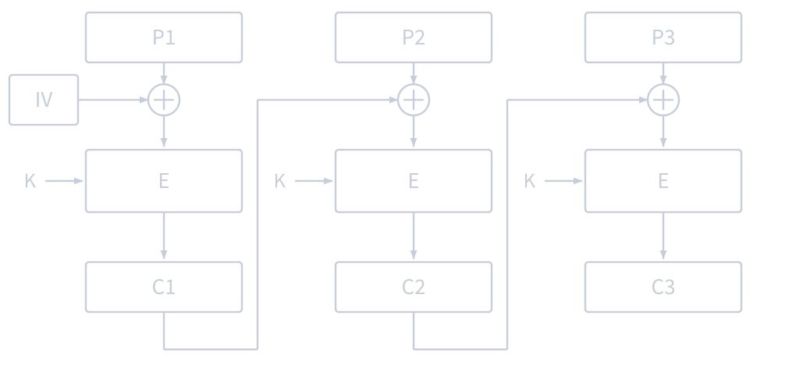
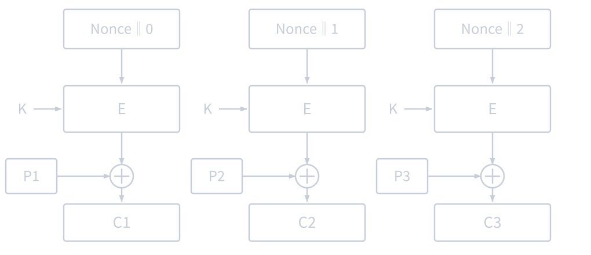
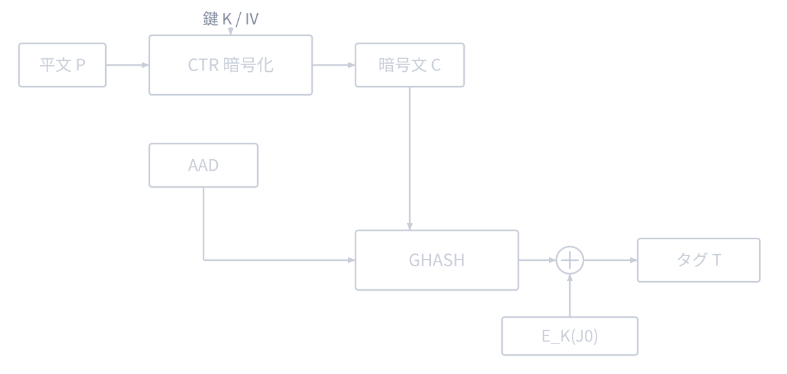
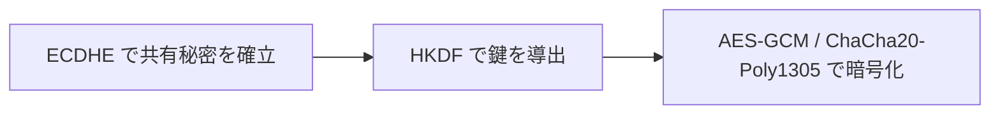

[前回](/blog/2026/crypto_3)では，DH / ECDH 鍵共有で共通の秘密鍵を確立する方法を解説しました．
本稿では，共通鍵暗号，特に AES-GCM と ChaCha20-Poly1305 を扱います．ブラウザの Web Crypto API や Node.js の `crypto.subtle` で最初に触れることが多い題材です．

シリーズ目次

1. [抽象代数学の基礎](/blog/2026/crypto_1)
2. [楕円曲線](/blog/2026/crypto_2)
3. [DH 鍵共有，ECDH 鍵共有](/blog/2026/crypto_3)
4. **共通鍵暗号 (AES など)** (本稿)
5. [公開鍵暗号 (RSA, ECC など)](/blog/2026/crypto_5)
6. TLS
7. (余談) SSH

## 共通鍵暗号の分類

共通鍵暗号は大きく 2 種類に分類されます．

### ブロック暗号

平文を **固定長のブロック** (例: 128 ビット) に分割し，ブロック単位で暗号化する方式です．

代表例: AES, DES (廃止), 3DES (非推奨)

### ストリーム暗号

鍵ストリーム (擬似ランダムなビット列) を生成し，平文と XOR して暗号化する方式です．

代表例: ChaCha20, RC4 (廃止)

実際の通信では，ブロック暗号を 暗号利用モード と組み合わせて使うか，ストリーム暗号を使います．
現在の主流は AES-GCM と ChaCha20-Poly1305 のような AEAD (Authenticated Encryption with Associated Data) です．

## AES (Advanced Encryption Standard)

### 背景

AES は，2001 年に NIST が [FIPS 197](https://csrc.nist.gov/pubs/fips/197/final) として標準化したブロック暗号です．

それ以前の標準であった DES (Data Encryption Standard, 1977) は鍵長 56 ビットと短く，1999 年に約 22 時間で総当たり解読されました．
NIST は後継アルゴリズムを公募し，世界中から 15 の候補が集まりました．最終的に ベルギーの方が設計したアルゴリズムが採用され，AES となりました．

### AES の基本仕様

- **ブロック長**: 128 ビット (16 バイト) 固定
- **鍵長**: 128 / 192 / 256 ビット (それぞれ AES-128, AES-192, AES-256)
- **ラウンド数**: 鍵長に応じて 10 / 12 / 14 ラウンド

### AES の構造

AES は **SPN 構造** (Substitution-Permutation Network) に基づいています．
入力の 128 ビットを 4×4 のバイト行列 (ステート) として扱い，各ラウンドで以下の 4 つの変換を適用します．

**1. SubBytes (バイト置換)**

各バイトを **S-Box** (置換テーブル) で非線形に変換します．
S-Box は $\mathrm{GF}(2^8)$（[第1章](/blog/2026/crypto_1/#有限体-gfp)で扱った有限体の拡大体）上の乗法逆元とアフィン変換の組み合わせで構成されており，数学的に設計されています．

この非線形変換が，AES の安全性の中核です．線形な暗号は簡単に解読できてしまうため，非線形性が不可欠です．

**2. ShiftRows (行シフト)**

ステートの各行を左に巡回シフトします．
- 第 0 行: シフトなし
- 第 1 行: 1 バイト左シフト
- 第 2 行: 2 バイト左シフト
- 第 3 行: 3 バイト左シフト

これにより，列方向の依存関係が行方向に拡散されます．

**3. MixColumns (列混合)**

各列を $\mathrm{GF}(2^8)$ 上の行列乗算で変換します．
これにより，1 バイトの変化が列全体に拡散されます (拡散性)．

最終ラウンドでは MixColumns は行われません．

**4. AddRoundKey (ラウンド鍵加算)**

ステートとラウンド鍵の XOR を取ります．
ラウンド鍵は，元の鍵から鍵スケジュールアルゴリズムで生成されます．

### なぜ AES は安全なのか

- **拡散 (Diffusion)**: 平文の 1 ビットの変化が，暗号文全体に影響 (ShiftRows + MixColumns)
- **混乱 (Confusion)**: 鍵と暗号文の関係を複雑にする (SubBytes + AddRoundKey)
- 十分なラウンド数により，これらの効果が累積し，既知の攻撃手法に対して安全

理論的には総当たりよりわずかに有利な解析も研究されていますが，必要なデータ量や計算量は非現実的で，実用的な攻撃は知られていません．

## 暗号利用モード

AES は 128 ビットのブロックしか暗号化できません．実際のデータは 128 ビットより長いため，**暗号利用モード** でブロック暗号を繰り返し適用します．

### ECB モード (使ってはいけない)

**Electronic Codebook** モード．各ブロックを独立に暗号化します．**脆弱なため絶対に使わないようにしましょう．**

- 同じ平文ブロック → 同じ暗号文ブロック
- パターンが漏洩する (有名な例: ECB ペンギン)

### CBC モード

**Cipher Block Chaining** モード．前のブロックの暗号文を次のブロックの平文に XOR してから暗号化します．

- 最初のブロックには **初期化ベクトル (IV)** を使用
- 同じ平文でも IV が異なれば異なる暗号文になる
- パディングが必要 (平文長がブロック長の倍数でない場合)
- **パディングオラクル攻撃** の脆弱性がある → 現在は非推奨

式で書くと $C_i = E_K(P_i \oplus C_{i-1})$ です．最初のブロックには $C_{i-1}$ にあたるものがないため，IV を使います．

### CTR モード

**Counter** モード．カウンタ値を暗号化してキーストリームを生成し，平文と XOR します．

- ブロック暗号をストリーム暗号のように使う
- パディング不要
- 並列処理が可能
- ただし，**改ざん検知機能がない**

式で書くと $C_i = E_K(\mathrm{Nonce} \| i) \oplus P_i$ です．鍵ストリームは平文と無関係に作れるため，事前計算やブロック単位の並列計算ができます．

### GCM モード (推奨)

**Galois/Counter Mode**．最近では，一番よく目にするものです．CTR モードによる暗号化に加えて，**認証タグ** を生成する AEAD モードです．

次のセクションで詳しく解説します．

## AEAD (Authenticated Encryption with Associated Data)

### なぜ認証付き暗号が必要か

暗号化だけでは **機密性** しか保証されません．攻撃者が暗号文を改ざんしても，受信者はそれを検知できません．

たとえば，CTR モードでは，暗号文の特定ビットを反転すると，復号結果の対応するビットが反転します (ビットフリッピング攻撃)．

**AEAD** は，1 つのアルゴリズムで **機密性** と **完全性 (改ざん検知)** の両方を提供します．

### AES-GCM

[NIST SP 800-38D](https://csrc.nist.gov/pubs/sp/800/38/d/final) で標準化された AEAD アルゴリズムです．

**入力:**
- 鍵 K (128 / 256 ビット)
- 初期化ベクトル IV (96 ビット推奨)
- 平文 P
- 関連データ AAD (Additional Authenticated Data)

**出力:**
- 暗号文 C (P と同じ長さ)
- 認証タグ T (128 ビット)

**仕組み:**
1. CTR モードで平文を暗号化 → 暗号文 C
2. $\mathrm{GF}(2^{128})$（[第1章](/blog/2026/crypto_1/#有限体-gfp)の有限体を拡張した体）上のガロア体乗算 (GHASH) で暗号文と AAD から認証タグ T を計算

**AAD (関連データ)** は暗号化されないが，認証の対象になるデータです．
たとえば，TLS では，レコードヘッダ (プロトコルバージョンやレコード長) が AAD として認証されます．ヘッダは平文で送る必要がありますが，改ざんは検知したいというユースケースです．

復号時に認証タグが一致しなければ，データは改ざんされたとして復号を拒否します．

ブラウザの Web Crypto API が直接提供している AES も基本的には AES-GCM です．
AES-CBC や AES-CTR を選ぶことはできますが，その場合は改ざん検知を別途設計する必要があります．

AES-GCM の構成を図にすると，次のようになります．

### AES-GCM の注意点

- **IV の再利用は致命的**: 同じ鍵で同じ IV を使うと，暗号文同士から平文同士の関係が漏れ，タグ偽造にも繋がり得る
- IV はランダム生成 (96 ビット) または単調増加カウンタで管理する
- TLS 1.3 ではシーケンス番号と IV の XOR でナンスを生成し，再利用を防止

## ChaCha20-Poly1305

### 概要

Google の Adam Langley らが TLS 向けに提案し，[RFC 8439](https://datatracker.ietf.org/doc/html/rfc8439) で標準化された AEAD アルゴリズムです．

- **ChaCha20**: Daniel J. Bernstein が設計したストリーム暗号
- **Poly1305**: 同じく Bernstein が設計した MAC (Message Authentication Code)

### 内部構造

ChaCha20 は 4×4・32 ビットの状態行列を，加算・XOR・回転 (ARX) だけで撹拌してキーストリームを作ります．乗算やテーブル参照を使わないため，定数時間で実装しやすくサイドチャネル攻撃に強いのが特長です．

状態行列 (16 ワード = 64 バイト) の中身は次の通りです．

| 行  | 内容                                               |
| --- | -------------------------------------------------- |
| 0   | 定数 `expand 32-byte k` (4 ワード)                 |
| 1-2 | 256 ビットの鍵 (8 ワード)                          |
| 3   | 32 ビットのカウンタ + 96 ビットのナンス (4 ワード) |

撹拌の中心が quarter-round です．4 つのワード $a, b, c, d$ に対して，加算 ($\bmod\ 2^{32}$)，XOR，左回転 $\lll$ を次の順で適用します．

<!-- textlint-disable ja-technical-writing/sentence-length -->

$$
\begin{aligned}
a &\leftarrow a + b, & d &\leftarrow (d \oplus a) \lll 16 \\
c &\leftarrow c + d, & b &\leftarrow (b \oplus c) \lll 12 \\
a &\leftarrow a + b, & d &\leftarrow (d \oplus a) \lll 8 \\
c &\leftarrow c + d, & b &\leftarrow (b \oplus c) \lll 7
\end{aligned}
$$

<!-- textlint-enable ja-technical-writing/sentence-length -->

これを列方向と対角方向に交互に適用し，計 20 ラウンド回します．最後に元の状態を足し戻して，64 バイトのキーストリームブロックを得ます．

AEAD としての組み立ては，カウンタの値で役割を分けるところが肝です．

| カウンタ | 用途                                                           |
| -------- | -------------------------------------------------------------- |
| 0        | 出力の先頭 32 バイトを Poly1305 の一度きりの鍵 $(r, s)$ にする |
| 1 以降   | キーストリームとして平文と XOR し，暗号文を作る                |

Poly1305 は，認証対象を 16 バイトずつのブロック $c_1, \ldots, c_n$ に区切り (各ブロックの末尾に $\mathtt{0x01}$ を付ける)，$2^{130}-5$ を法とする多項式として評価します．

$$
\mathrm{Tag} = \left( \sum_{i=1}^{n} c_i \, r^{\,n-i+1} \bmod (2^{130}-5) \right) + s \bmod 2^{128}
$$

認証対象は AAD・暗号文・それぞれの長さを連結したものです．鍵 $(r, s)$ がメッセージごとに使い捨てであることが安全性の前提なので，ナンスを再利用するとこの前提が崩れます．

内部の詳しい動きは [tex2e 氏の解説](https://tex2e.github.io/blog/crypto/chacha20poly1305) が分かりやすいです．

### AES-GCM との比較

|                    |         AES-GCM          |        ChaCha20-Poly1305        |
| ------------------ | :----------------------: | :-----------------------------: |
| 種類               |   ブロック暗号 + AEAD    |   AEAD (ChaCha20 + Poly1305)    |
| ハードウェア支援   |    AES-NI (Intel/AMD)    |  なし (ソフトウェア実装が高速)  |
| モバイル/組込み    |   AES-NI なしでは遅い    |       **高速** (ARM など)       |
| サイドチャネル耐性 | テーブル参照に注意が必要 | **設計上安全** (テーブル不使用) |
| TLS 1.3            |         サポート         |            サポート             |

AES-NI (ハードウェアアクセラレーション) がある環境では AES-GCM が高速ですが，ない環境 (古いモバイル端末など) では ChaCha20-Poly1305 が優位です．
ChaCha20-Poly1305 でも，AES-GCM と同様にナンスの再利用は避けなければなりません．

TLS 1.3 では両方がサポートされており，クライアントとサーバのネゴシエーションで選択されます．

☕ コラム: Google と ChaCha20-Poly1305

ChaCha20-Poly1305 が広まったのは，Google の貢献が大きいです．

2014 年頃，Android 端末の多くは AES-NI をサポートしておらず，AES-GCM のソフトウェア実装は遅すぎて実用的ではありませんでした．
Google は Chrome と Android で ChaCha20-Poly1305 を積極的に採用し，モバイルでの HTTPS 体験を改善しました．

現在では新しい ARM プロセッサに AES ハードウェア支援が搭載されるようになりましたが，ChaCha20-Poly1305 はその設計のエレガントさとサイドチャネル耐性から，引き続き広く使われています．

## ハイブリッド暗号

実際の暗号通信では，共通鍵暗号と公開鍵暗号 (または鍵共有) を **組み合わせて** 使います．これを **ハイブリッド暗号** と呼びます．

1. **鍵交換**: ECDHE で共有秘密を確立 ([第3章](/blog/2026/crypto_3/#ecdh-鍵共有))
2. **鍵導出**: 共有秘密から暗号鍵を導出 (HKDF 等)
3. **データ暗号化**: 導出した鍵で AES-GCM や ChaCha20-Poly1305 を使ってデータを暗号化

公開鍵暗号や鍵共有は計算コストが高いため，**鍵の確立にのみ使用** し，実際のデータ暗号化には高速な共通鍵暗号を使うのが一般的です．

全体の流れは次の通りです．

TLS, SSH, Signal プロトコルなど，現代の暗号プロトコルはすべてこのハイブリッド方式を採用しています．

---
#### 参考文献

- [NIST FIPS 197: Advanced Encryption Standard (AES)](https://csrc.nist.gov/pubs/fips/197/final)
- [NIST SP 800-38D: Recommendation for Block Cipher Modes of Operation: Galois/Counter Mode (GCM) and GMAC](https://csrc.nist.gov/pubs/sp/800/38/d/final)
- [RFC 8439: ChaCha20 and Poly1305 for IETF Protocols](https://datatracker.ietf.org/doc/html/rfc8439)
- [ChaCha20-Poly1305 の仕組み (tex2e)](https://tex2e.github.io/blog/crypto/chacha20poly1305) — ChaCha20 と Poly1305 の内部構造の解説
- [NIST SP 800-38A: Recommendation for Block Cipher Modes of Operation](https://csrc.nist.gov/pubs/sp/800/38/a/final) — ECB, CBC, CTR 等のモード
- Daniel J. Bernstein, "The Salsa20 family of stream ciphers", 2008 — ChaCha20 の設計思想
