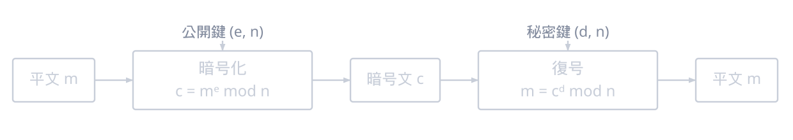
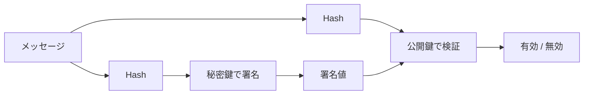
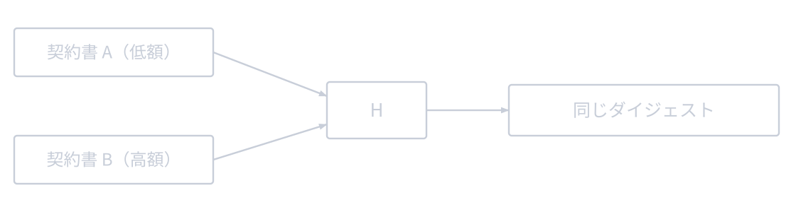
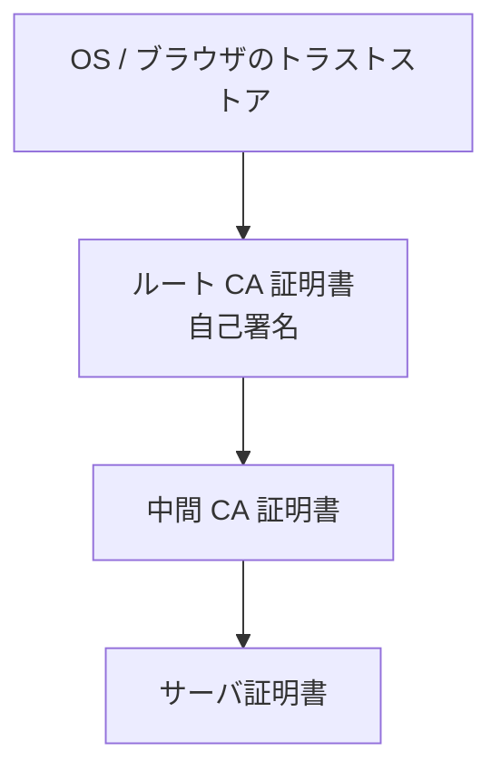

[前回](/blog/2026/crypto_4)では，共通鍵暗号でデータを暗号化する仕組みを解説しました．
本稿では，公開鍵暗号とデジタル署名を扱います．HTTPS の証明書検証や，`ssh-keygen` で作った鍵の署名検証も，ここで扱う内容に繋がります．

<details>
<summary>シリーズ目次</summary>

1. [抽象代数学の基礎](/blog/2026/crypto_1)
2. [楕円曲線](/blog/2026/crypto_2)
3. [DH 鍵共有，ECDH 鍵共有](/blog/2026/crypto_3)
4. [共通鍵暗号 (AES など)](/blog/2026/crypto_4)
5. **公開鍵暗号 (RSA, ECC など)** (本稿)
6. TLS
7. (余談) SSH

</details>

## 公開鍵暗号の考え方

共通鍵暗号では，送信者と受信者が同じ鍵を共有する必要がありました．
公開鍵暗号では，各ユーザが鍵ペアを持ちます．

- **公開鍵 (Public Key)**: 誰にでも公開してよい鍵
- **秘密鍵 (Private Key)**: 所有者だけが保持する鍵

暗号化には受信者の公開鍵を使い，復号には受信者の秘密鍵を使います．
公開鍵から秘密鍵を求めることが計算困難であるため，公開鍵を公開しても安全です．

## RSA

### 概要

RSA は，1977 年に Ron **R**ivest, Adi **S**hamir, Leonard **A**dleman が発表した公開鍵暗号の方式で，**素因数分解の問題** の困難性に基づいています．
(Shamir 先生は暗号分野のいろんなとこで名前を見ます．)

### 鍵生成

1. 大きな素数 $p, q$ をランダムに選ぶ (それぞれ 1024 ビット以上)
2. $n = p \times q$ を計算 (RSA モジュロス)
3. オイラーのトーシェント関数 $\varphi(n) = (p-1)(q-1)$ を計算
4. $\varphi(n)$ と互いに素な整数 $e$ を選ぶ (一般的に $e = 65537 = 2^{16} + 1$)
5. $e \times d \equiv 1 \pmod{\varphi(n)}$ を満たす $d$ を計算（[第1章](/blog/2026/crypto_1/#拡張ユークリッドの互除法)の拡張ユークリッドの互除法）

- **公開鍵**: $(n, e)$
- **秘密鍵**: $(n, d)$

### 暗号化・復号

- 暗号化: $c = m^e \bmod n$($m$: 平文，$c$: 暗号文)
- 復号: $m = c^d \bmod n$

[フェルマーの小定理](/blog/2026/crypto_1/#フェルマーの小定理) (より正確にはオイラーの定理) により，$(m^e)^d \equiv m \pmod{n}$ が成り立ちます．



<details>
<summary>具体例（小さな数で試す）</summary>

- 素数 $p = 61,\ q = 53$ → $n = pq = 3233$，$\varphi(n) = (p-1)(q-1) = 3120$
- $e = 17$（$\varphi(n)$ と互いに素）→ $d = e^{-1} \bmod \varphi(n) = 2753$
- 平文 $m = 65$ を暗号化: $c = 65^{17} \bmod 3233 = 2790$
- 復号: $m = 2790^{2753} \bmod 3233 = 65$

$17 \times 2753 = 46801 \equiv 1 \pmod{3120}$ なので，暗号化と復号がちょうど打ち消し合って元に戻ります．実際の RSA はこれを 2048 ビット以上の巨大な素数で行います．

</details>

### RSA の安全性

RSA の安全性は，**$n = p \times q$ の素因数分解が困難** であることに基づきます．

$n$ が与えられたとき $p$ と $q$ を求められれば，$\varphi(n)$ を計算でき，$d$ を算出できてしまいます．
しかし，$n$ が十分大きければ (2048 ビット以上)，現在の計算機では素因数分解は実行不可能です．

|  RSA 鍵長   | 安全性レベル |       推奨状況        |
| :---------: | :----------: | :-------------------: |
| 1024 ビット |  ~80 ビット  | ❌ 非推奨 (2010年以降) |
| 2048 ビット | ~112 ビット  |     ✅ 最低限推奨      |
| 3072 ビット | ~128 ビット  |        ✅ 推奨         |

(参考: [NIST SP 800-57](https://csrc.nist.gov/pubs/sp/800/57/pt1/r5/final))

### 素数の選び方が甘いと破れる

RSA は「$n$ を素因数分解できない」ことが前提ですが，**素数 $p, q$ の選び方**が悪いと分解できてしまいます．鍵長が足りていても脆弱になる，という点が重要です．

- **乱数が弱い**: 乱数生成器の質が低いと $p, q$ が予測可能になります．Debian OpenSSL の PRNG バグ (2008) では生成されうる鍵が極端に限られ，大量の脆弱な鍵が実際に出回りました．
- **素数の使い回し**: 別々の鍵がたまたま素数を共有すると，2 つの公開鍵から $\gcd(n_1, n_2)$ を計算するだけで共通の素数が求まり，両方の秘密鍵が割れます．2012 年の大規模調査 ("Ron was wrong, Whit is right") では，公開されていた多数の RSA 鍵がこの方法で破られました．公開鍵を集めて GCD を取るだけでよく，攻撃コストが低いのが怖い点です．
- **$p$ と $q$ が近すぎる**: 差が小さいと **フェルマー法** で簡単に分解されます．Infineon 製チップの偏った素数生成 (ROCA, 2017) のように，生成方法に癖があると分解が現実的になります．

実務では，鍵は信頼できるライブラリ (OpenSSL, libsodium など) の安全な乱数で生成し，自前実装や弱い RNG，鍵の使い回しを避けます．脆弱性対応の観点では，「鍵長は足りているか」だけでなく「その鍵がどう生成されたか」まで見る必要がある，ということです．

### OAEP パディング

素の RSA (教科書的 RSA) にはいくつかの脆弱性があります．たとえば，同じ平文を同じ公開鍵で暗号化すると同じ暗号文が得られるため，辞書攻撃が可能です．

**RSA-OAEP** (Optimal Asymmetric Encryption Padding, [RFC 8017](https://datatracker.ietf.org/doc/html/rfc8017)) は，ランダムなパディングを追加することでこの問題を解決します．

実用上，RSA を暗号化に使う場合は **必ず OAEP を使用** します．
なお，Web PKI や TLS 1.3 で RSA が登場する場面は，主に証明書や署名であり，RSA そのものでアプリケーションデータを暗号化するわけではありません．

## 楕円曲線暗号 (ECC)

[第2章](/blog/2026/crypto_2)で解説した楕円曲線を使った暗号方式群です．RSA と比較して短い鍵で同等の安全性を提供します．

### ECDSA (楕円曲線デジタル署名アルゴリズム)

[NIST FIPS 186-5](https://csrc.nist.gov/pubs/fips/186-5/final) で標準化された署名アルゴリズムです．

**鍵ペア:**
- 秘密鍵: 整数 $d$ (ランダムに選択)
- 公開鍵: 点 $Q = dG$（$G$ は [第2章](/blog/2026/crypto_2) で扱った基点，$dG$ はスカラー倍）

**署名生成** (秘密鍵 $d$ でメッセージ $m$ に署名) の手順です．
1. ランダムな整数 $k$ を選ぶ
2. 点 $(x_1, y_1) = kG$ を計算
3. $r = x_1 \bmod n$ を計算 ($n$ は $G$ の位数)
4. $s = k^{-1}(H(m) + rd) \bmod n$ を計算 ($H$ はハッシュ関数)
5. 署名は $(r, s)$

この $k$ は毎回一意で秘密でなければならず，再利用や偏りは秘密鍵漏洩に直結します．
そのため実装では，RFC 6979 に従ってメッセージと秘密鍵から決定的に $k$ を生成することも多いです．

**署名検証** (公開鍵 $Q$ で署名 $(r, s)$ を検証) の手順です．
1. $u_1 = H(m) \times s^{-1} \bmod n$，$u_2 = r \times s^{-1} \bmod n$ を計算
2. 点 $(x_1, y_1) = u_1 G + u_2 Q$ を計算
3. $x_1 \bmod n = r$ なら署名は有効

### EdDSA / Ed25519

[RFC 8032](https://datatracker.ietf.org/doc/html/rfc8032) で標準化されたデジタル署名アルゴリズムです．

Curve25519 と同じ体上のツイスト・エドワーズ曲線 **Edwards25519** を使用します．

ECDSA との主な違いは次の通りです．
- **決定的**: 署名時にランダム値を使わない (ランダム値の生成ミスによる秘密鍵漏洩を防ぐ)
- **高速**: 定数時間実装が容易
- **シンプル**: 実装ミスが起きにくい設計

SSH では `ssh-ed25519` として広く使われており，**新規の鍵生成には Ed25519 が推奨** されています．

## デジタル署名

### 目的

デジタル署名は，以下の 3 つの性質を提供します．

1. **認証 (Authentication)**: 署名者の身元を確認
2. **完全性 (Integrity)**: データが改ざんされていないことを確認
3. **非否認性 (運用込み)**: 適切な本人確認と鍵管理が前提なら，後から「署名していない」と言い逃れしにくくする

### 一般的な署名の流れ

1. **署名者**: メッセージのハッシュを計算し，秘密鍵で署名
2. **検証者**: メッセージのハッシュを計算し，署名者の公開鍵で署名を検証

```
署名: Sign(秘密鍵, Hash(メッセージ)) → 署名値
検証: Verify(公開鍵, Hash(メッセージ), 署名値) → 有効/無効
```

図にすると，次のような流れです．



### 主な署名アルゴリズム

| アルゴリズム  | 基盤       |   鍵長    | 推奨状況 |
| ------------- | ---------- | :-------: | -------- |
| RSA-PSS       | 素因数分解 | 2048+ bit | ✅ 推奨   |
| ECDSA (P-256) | ECDLP      |  256 bit  | ✅ 推奨   |
| Ed25519       | ECDLP      |  256 bit  | ✅ 推奨   |

## ハッシュ関数

デジタル署名にはハッシュ関数が不可欠です．

### 暗号学的ハッシュ関数の性質

任意長の入力から固定長の出力 (ハッシュ値 / ダイジェスト) を生成する関数で，以下の性質を満たす必要があります．

1. **原像耐性**: ハッシュ値 $h$ から，$H(m) = h$ となる $m$ を求めることが困難
2. **第二原像耐性**: $m_1$ が与えられたとき，$H(m_1) = H(m_2)$ となる $m_2$ を求めることが困難
3. **衝突耐性**: $H(m_1) = H(m_2)$ となる異なる $m_1, m_2$ の組を見つけることが困難

### 主なハッシュ関数

| アルゴリズム         |       出力長        | 推奨状況                                |
| -------------------- | :-----------------: | --------------------------------------- |
| MD5                  |       128 bit       | ❌ 破られている                          |
| SHA-1                |       160 bit       | ❌ 衝突が発見されている (2017年，Google) |
| SHA-256 (SHA-2)      |       256 bit       | ✅ 推奨                                  |
| SHA-384 (SHA-2)      |       384 bit       | ✅ 推奨                                  |
| SHA3-256 / 384 / 512 | 256 / 384 / 512 bit | ✅ 推奨                                  |

TLS 1.3 では SHA-256 以上のハッシュ関数が使用されます．

### 「破られている」とは何か

表の「破られている」は，多くの場合 **衝突耐性が破られた** ことを指します．上の 3 つの性質のどれが破れたかで，意味も実害も変わります．

- **MD5**: 衝突を現実的な計算で作れます．実害の例として，マルウェア **Flame** (2012) が MD5 衝突を悪用して Microsoft のコード署名証明書を偽造し，正規の Windows Update になりすまして感染を広げました．
- **SHA-1**: 2017 年の SHAttered で衝突が実証され，2020 年の "SHA-1 is a Shambles" では任意の接頭辞を選べる衝突 (chosen-prefix collision) まで現実的なコストになりました．証明書や Git のように「ハッシュが同じなら同じもの」とみなす用途で危険です．

注意したいのは，「破られている＝ハッシュから元の入力を逆算できる」ではないことです．原像耐性 (ハッシュ値から入力を求める) は MD5 や SHA-1 でも簡単には破れていません．破られているのは主に「**同じハッシュ値を持つ別のデータを作れる**」という衝突耐性で，署名・証明書のように「正しいものと偽物を取り違えさせたい」攻撃で致命的になります．



逆に言えば，パスワードの保存のように原像耐性が要る用途と，署名のように衝突耐性が要る用途では，「破られた」の重みが違います．脆弱性対応では，そのハッシュが **何のために使われているか** まで見て判断する必要があります．

<details>
<summary>☕ コラム: SHA-1 の衝突 — SHAttered</summary>

2017 年，Google と CWI Amsterdam のチームが SHA-1 の衝突を実際に生成することに成功しました ([SHAttered](https://marc-stevens.nl/research/shattered.io/)，[Google の発表](https://security.googleblog.com/2017/02/announcing-first-sha1-collision.html))．

異なる内容の 2 つの PDF ファイルが同じ SHA-1 ハッシュ値を持つことを実証し，SHA-1 の安全性が実用上も損なわれていることを示しました．

この成果には約 6,500 年分の CPU 計算と約 110 年分の GPU 計算が必要でしたが，クラウドコンピューティングの時代には決して非現実的なコストではありません．

これをきっかけに，Git のハッシュアルゴリズムも SHA-1 から SHA-256 への移行が進められています．

</details>

## 証明書と PKI

### 問題: 公開鍵の信頼性

公開鍵暗号やデジタル署名で残る問題は，「この公開鍵が本当にその人のものか」をどう確認するかです．

[第3章](/blog/2026/crypto_3)で触れた中間者攻撃と同じ問題です．攻撃者が偽の公開鍵を配布すれば，暗号通信を傍受できます．

### X.509 証明書

この問題を解決するのが **X.509 証明書** ([RFC 5280](https://datatracker.ietf.org/doc/html/rfc5280)) です．

証明書は，信頼された **認証局 (CA: Certificate Authority)** が「この公開鍵はこのエンティティのものである」とデジタル署名で保証するものです．

証明書に含まれる主な情報は次の通りです．
- **Subject**: 証明書の所有者 (ドメイン名，組織名など)
- **公開鍵**: Subject の公開鍵
- **Issuer**: 証明書を発行した CA
- **有効期間**: 開始日と終了日
- **CA のデジタル署名**: 上記情報に対する CA の署名
- **シリアル番号**: 証明書の一意な識別子

### 証明書チェーン

CA の証明書自体も，別の CA (上位 CA) が署名しています．これが連鎖し，最上位の **ルート CA** に至ります．



ブラウザや OS は，信頼するルート CA の証明書を **トラストストア** として保持しています．
サーバ証明書の検証は，このチェーンを辿ってルート CA に到達できるかを確認します．

### 証明書の失効

証明書が危殆化 (秘密鍵の漏洩など) した場合に備えて，失効の仕組みがあります．

- **CRL (Certificate Revocation List)**: CA が失効した証明書のリストを公開
- **OCSP (Online Certificate Status Protocol)**: リアルタイムに証明書の有効性を問い合わせ

TLS では，OCSP Stapling (サーバが OCSP レスポンスを TLS ハンドシェイクに含める方式) が広く使われます．

認証情報を発行するときには，PKI に限らず，Revoke 可能であることが非常に大切です．

---
#### 参考文献

- [NIST FIPS 186-5: Digital Signature Standard (DSS)](https://csrc.nist.gov/pubs/fips/186-5/final) — ECDSA, RSA-PSS 等の標準
- [RFC 8017: PKCS #1: RSA Cryptography Specifications Version 2.2](https://datatracker.ietf.org/doc/html/rfc8017) — RSA-OAEP, RSA-PSS
- [RFC 6979: Deterministic Usage of the Digital Signature Algorithm (DSA) and ECDSA](https://datatracker.ietf.org/doc/html/rfc6979) — 決定的 ECDSA
- [RFC 8032: Edwards-Curve Digital Signature Algorithm (EdDSA)](https://datatracker.ietf.org/doc/html/rfc8032) — Ed25519, Ed448
- [RFC 5280: Internet X.509 Public Key Infrastructure Certificate and CRL Profile](https://datatracker.ietf.org/doc/html/rfc5280)
- [NIST SP 800-57 Part 1 Rev.5](https://csrc.nist.gov/pubs/sp/800/57/pt1/r5/final) — 鍵長の推奨値
- [Announcing the first SHA1 collision (Google Security Blog)](https://security.googleblog.com/2017/02/announcing-first-sha1-collision.html) — SHAttered の公式発表
- [SHAttered (Marc Stevens)](https://marc-stevens.nl/research/shattered.io/) — SHA-1 衝突の実証（著者による解説ページ）
