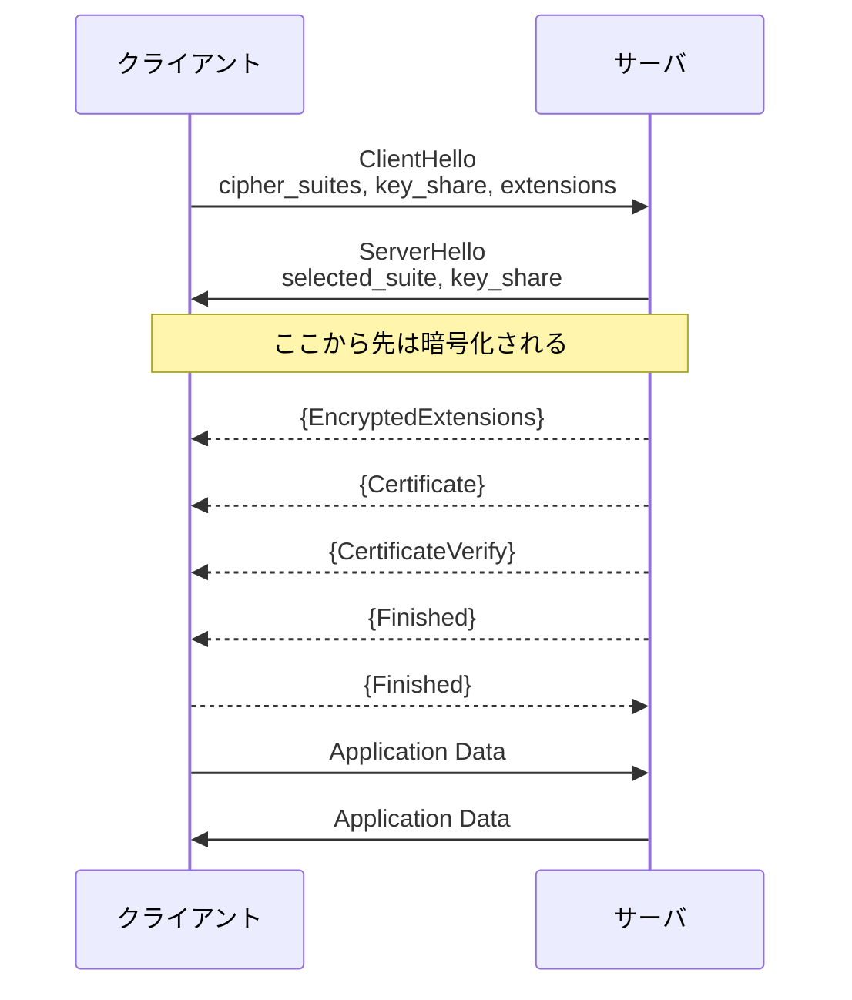
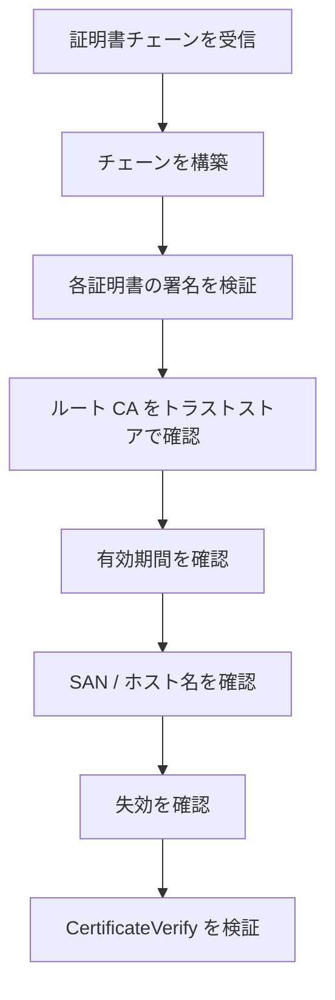

[第1章](/blog/2026/crypto_1)から[第5章](/blog/2026/crypto_5)まで解説してきた暗号技術が，**TLS (Transport Layer Security)** の中でどのように組み合わされているかを見ていきます．ブラウザのアドレスバーに表示される鍵マークの裏側にある仕組みが対象です．
ようやく Web エンジニアになじみのあるレイヤまで登ってこれました．

<details>
<summary>シリーズ目次</summary>

1. [抽象代数学の基礎](/blog/2026/crypto_1)
2. [楕円曲線](/blog/2026/crypto_2)
3. [DH 鍵共有，ECDH 鍵共有](/blog/2026/crypto_3)
4. [共通鍵暗号 (AES など)](/blog/2026/crypto_4)
5. [公開鍵暗号 (RSA, ECC など)](/blog/2026/crypto_5)
6. **TLS** (本稿)

</details>

## TLS とは

TLS は，**信頼できる順序付きバイトストリーム** の上で **機密性**・**完全性**・**認証** を提供するプロトコルです．

HTTPS (HTTP over TLS) として Web の暗号化通信に使われるほか，SMTP, IMAP, LDAP など多くのプロトコルの暗号化にも使用されます．
HTTP/3 では QUIC が TLS 1.3 のハンドシェイクを取り込みますが，鍵交換や証明書検証の考え方は本稿の理解で追えます．

### 歴史

| プロトコル |  年   | 状況                                                               |
| ---------- | :---: | ------------------------------------------------------------------ |
| SSL 2.0    | 1995  | ❌ 廃止 (深刻な脆弱性)                                              |
| SSL 3.0    | 1996  | ❌ 廃止 (POODLE 攻撃)                                               |
| TLS 1.0    | 1999  | ❌ 廃止 ([RFC 8996](https://datatracker.ietf.org/doc/html/rfc8996)) |
| TLS 1.1    | 2006  | ❌ 廃止 (RFC 8996)                                                  |
| TLS 1.2    | 2008  | ⚠️ 現役だがそろそろ移行推奨                                         |
| TLS 1.3    | 2018  | ✅ 推奨 ([RFC 9846](https://datatracker.ietf.org/doc/html/rfc9846)) |

TLS 1.3 は 2018 年に RFC 8446 として標準化され，大幅なセキュリティ改善とパフォーマンス向上が図られました．
2026 年 7 月に改訂版の [RFC 9846](https://datatracker.ietf.org/doc/html/rfc9846) が公開され，RFC 8446 は廃止されています．現在の TLS 1.3 の仕様書は RFC 9846 です．

RFC 9846 は同時に，TLS 1.2 の RFC 5246，セッションチケットの RFC 5077，OCSP マルチステープリングの RFC 6961，Extended Master Secret の RFC 7627，ECC 暗号スイートの RFC 8422 も廃止しています．

改訂といってもバージョン番号は 1.3 のままで，後方互換です．RFC 9846 自身が「minor update」と述べているとおり，曖昧だった記述の明確化と要件の引き締めが主眼です．技術的な変更としては，次のようなものがあります．

- KeyShare の値をコネクション間で使い回すことを禁止
- TLS 1.0 / 1.1 のネゴシエーションを禁止
- KeyUpdate の要件を MUST に格上げし，送出できる回数を制限
- 秘密の名称から "master" を排し，"main" などに変更 (e.g. master secret → main secret)

本稿では主に TLS 1.3 を解説します．

<details>
<summary>☕ コラム: SSL と TLS — 名前の由来</summary>

SSL (Secure Sockets Layer) は，1990 年代に Netscape が開発したプロトコルです．
SSL 3.0 をベースに IETF が標準化したものが TLS 1.0 で，中身は SSL 3.1 と呼ぶべきものでした．

これは RFC 2246 の編者である Tim Dierks 本人が[書いています](https://tim.dierks.org/2014/05/security-standards-and-name-changes-in.html)．Netscape と Microsoft の代表を集めて IETF での標準化に合意させる交渉の中で，こうなったそうです．

> As a part of the horsetrading, we had to make some changes to SSL 3.0 (so it wouldn't look the IETF was just rubberstamping Netscape's protocol), and we had to rename the protocol (for the same reason). And thus was born TLS 1.0 (which was really SSL 3.1).

「IETF が Netscape のプロトコルをただ追認しただけに見えないように」名前を変えた，というわけです．本人も同じ記事で "the whole thing looks silly" と振り返っています．

現在「SSL 証明書」と呼ばれるものは，実際には TLS で使用される X.509 証明書であり，SSL 自体はもう使われていません．「SSL/TLS」と併記されることも多いですが，厳密には「TLS」が正しい呼称です．

</details>

## TLS 1.3 ハンドシェイク

TLS 通信は，ハンドシェイクと呼ばれる初期フェーズで暗号パラメータを交渉し，その後アプリケーションデータを暗号化してやり取りします．

### 全体の流れ

TLS 1.3 のフルハンドシェイクは **1-RTT (1 Round Trip Time)** で完了します．
TLS 1.2 では 2-RTT が必要だったため，大幅な改善です．
ブラウザの DevTools に表示される `TLS_AES_128_GCM_SHA256` や `x25519` は，このハンドシェイクで交渉された結果です．



`{}` で囲まれたメッセージは暗号化されています．TLS 1.3 では ServerHello の直後から暗号化が始まります．

### 各ステップの詳細

1. **ClientHello**

クライアントが以下の情報を送信します．

- サポートする暗号スイートのリスト
- **key_share 拡張**: ECDHE の公開鍵 (X25519 や P-256) を事前に送信
- **supported_versions 拡張**: TLS 1.3 をサポートすることを明示
- **signature_algorithms 拡張**: サポートする署名アルゴリズム
- **server_name 拡張** (SNI): 接続先のホスト名 (ECH を使わない限り平文で見える)

TLS 1.3 の重要な改善点として，key_share を ClientHello に含めることで，サーバが鍵交換アルゴリズムを選択した時点で即座に共有秘密を計算できるようになっています．

2. **ServerHello**

サーバが以下を返します．

- 選択した暗号スイート
- **key_share**: サーバの ECDHE 公開鍵

この時点で，クライアントとサーバの双方が ECDHE 共有秘密を計算できます．
共有秘密から HKDF (HMAC-based Key Derivation Function) を使って各種暗号鍵を導出します．

3. **EncryptedExtensions**

サーバの拡張情報 (暗号化に関係しないもの) を暗号化して送信します．

4. **Certificate**

サーバの X.509 証明書チェーンを送信します ([第5章](/blog/2026/crypto_5#証明書チェーン))．

5. **CertificateVerify**

サーバが，ハンドシェイクメッセージ全体のハッシュに対して秘密鍵で署名します．

これにより，次のことが分かります．
- サーバが証明書に対応する秘密鍵を所有していることを証明
- ハンドシェイクメッセージが改ざんされていないことを保証
- [第3章](/blog/2026/crypto_3#中間者攻撃-mitm-と認証の必要性)で述べた MITM 攻撃を防止

6. **Finished**
7. **Finished**

ハンドシェイク全体のトランスクリプトハッシュに対する MAC を送信し，双方がハンドシェイクの完全性を検証します．

### Negotiation が失敗したら？

クライアントが並べた暗号スイートをサーバがひとつもサポートしていなかった場合，どうなるでしょうか？そのような場合は，ハンドシェイクが失敗します．
RFC 9846 [Section 4.2.1](https://datatracker.ietf.org/doc/html/rfc9846#section-4.2.1) は，パラメータが折り合わなかったサーバは `handshake_failure` または `insufficient_security` の fatal alert を送ってハンドシェイクを中断しなければならない (MUST)，と規定しています．`supported_groups` に重なりがない場合も同じです．
弱いアルゴリズムに落として繋ぎ直すような救済はありません．TLS 1.2 以前のダウングレードの歴史を思えば，これは正しい設計です．

## TLS 1.3 の暗号スイート

TLS 1.3 では暗号スイートが大幅に簡素化されました．

### TLS 1.2 との比較

TLS 1.2 の暗号スイートの例は次のようなものがあります．
```
TLS_ECDHE_RSA_WITH_AES_128_GCM_SHA256
```
鍵交換 (ECDHE) + 認証 (RSA) + 暗号化 (AES_128_GCM) + ハッシュ (SHA256) の 4 要素を指定．

TLS 1.3 の暗号スイートの例は次のようなものです．
```
TLS_AES_128_GCM_SHA256
```
暗号化 (AES_128_GCM) + ハッシュ (SHA256) の 2 要素のみ．鍵交換と認証は別の拡張で指定．

### TLS 1.3 で使える暗号スイート

TLS 1.3 では以下の 5 つだけが定義されています．

| 暗号スイート                 | AEAD                 | ハッシュ |
| ---------------------------- | -------------------- | -------- |
| TLS_AES_128_GCM_SHA256       | AES-128-GCM          | SHA-256  |
| TLS_AES_256_GCM_SHA384       | AES-256-GCM          | SHA-384  |
| TLS_CHACHA20_POLY1305_SHA256 | ChaCha20-Poly1305    | SHA-256  |
| TLS_AES_128_CCM_SHA256       | AES-128-CCM          | SHA-256  |
| TLS_AES_128_CCM_8_SHA256     | AES-128-CCM (短タグ) | SHA-256  |

すべて AEAD ([第4章](/blog/2026/crypto_4#aead-authenticated-encryption-with-associated-data)) であり，CBC モードのような非 AEAD は完全に排除されました．

### 鍵交換アルゴリズム

鍵交換は `supported_groups` 拡張で指定し，以下が利用可能です．

- X25519 (推奨)
- P-256 (secp256r1)
- P-384 (secp384r1)
- P-521 (secp521r1)
- X448
- FFDHE (有限体 DH) 群

## TLS 1.3 の主要な改善点

### TLS 1.2 から廃止されたもの

TLS 1.3 では，過去に脆弱性が指摘された多くの機能が廃止されました．

- **静的 RSA 鍵交換**: 前方秘匿性がないため廃止 ([第3章](/blog/2026/crypto_3#前方秘匿性とは))
- **CBC モード**: パディングオラクル攻撃の原因になるため廃止
- **RC4**: 統計的バイアスが発見されたため廃止
- **SHA-1**: 衝突が発見されたため廃止 ([第5章](/blog/2026/crypto_5))
- **圧縮**: CRIME 攻撃の原因になるため廃止
- **再ネゴシエーション**: 複雑さとセキュリティリスクのため廃止

### 0-RTT (Early Data)

TLS 1.3 では，過去に接続したことのあるサーバへの再接続時に **0-RTT** でアプリケーションデータを送信できます．

1. 初回接続のハンドシェイク後，サーバが **NewSessionTicket** メッセージでチケットをクライアントに渡す
2. 再接続時，クライアントはそのチケットを `pre_shared_key` 拡張に載せ，ClientHello と同時にアプリケーションデータを送信

#### PSK はどこに保持されるか

まず，**PSK (Pre-Shared Key) そのものはネットワークを流れません**．
サーバが NewSessionTicket で渡すのは `ticket` という不透明な値で，実際の PSK は両者が手元の `resumption_secret` から導出します ([RFC 9846§4.7.1](https://datatracker.ietf.org/doc/html/rfc9846#section-4.7.1))．

```
HKDF-Expand-Label(resumption_secret, "resumption", ticket_nonce, Hash.length)
```

`ticket` は PSK の identity として使われるだけです．中身はサーバの自由で，RFC 9846 は「データベースのルックアップキーでもよいし，サーバ自身が暗号化・認証した自己完結の値でもよい」としています．後者ならサーバ側に状態を持たずに済むため，広く使われています．

クライアント側の保持場所は仕様が規定しておらず，実装依存です．ブラウザは一般にプロセス内のセッションキャッシュに置きます．OpenSSL では `SSL_SESSION` オブジェクトで，明示すればファイルに書き出せます．

```bash
# セッションを保存して，次回それを使って再開する
openssl s_client -connect blog.jsmz.dev:443 -sess_out sess.pem
openssl s_client -connect blog.jsmz.dev:443 -sess_in sess.pem
```

保持できる期間には上限があります．`ticket_lifetime` は最大 604800 秒 (7 日) で，クライアントはこの値に関わらず発行から 7 日を超えてチケットを使ってはいけません．
チケットは事実上その接続を再開できる鍵材料なので，ディスクに残す場合は秘密鍵と同じ扱いが要ります．

#### リプレイ攻撃

0-RTT データには **リプレイ攻撃** の耐性がないという制限があります．
攻撃者が 0-RTT データをキャプチャして再送信すると，サーバはそれを新しいリクエストとして処理する可能性があります．
サーバは 0-RTT を受け付けず，通常の 1-RTT にフォールバックすることもあります．

そのため，0-RTT は **冪等な操作** (GET リクエストなど) にのみ使用し，**副作用のある操作** (POST リクエストなど) には使用すべきではありません．

<details>
<summary>☕ コラム: TLS 1.3 の策定に 4 年かかった理由</summary>

TLS 1.3 の最初の仕様である RFC 8446 が公開されたのは 2018 年ですが，最初のドラフトは 2014 年でした．約 4 年もの時間がかかった理由のひとつに，**ミドルボックス問題** があります．

企業のファイアウォールやロードバランサ (ミドルボックス) の多くが，TLS ハンドシェイクの特定のフィールドに依存して動作していました．TLS 1.3 でハンドシェイクの構造を変更したところ，これらのミドルボックスが接続を拒否するケースが多発しました．

最終的に，TLS 1.3 は **外見上は TLS 1.2 に見えるように偽装** する設計を採用しました．たとえば，ServerHello のバージョンフィールドには `0x0303` (TLS 1.2) と記載し，実際のバージョンは `supported_versions` 拡張で伝えます．

このような「後方互換性のためのハック」は美しくありませんが，インターネットの現実に対応するための実用的な妥協です．

</details>

## 証明書検証の流れ

TLS ハンドシェイクにおけるサーバ証明書の検証手順を整理します．

### 1. 証明書チェーンの構築

サーバから受信した証明書チェーンを，ルート CA まで辿ります．

### 2. 各証明書の署名検証

チェーン内の各証明書について，上位の CA の公開鍵で署名を検証します．

### 3. ルート CA の確認

チェーンの最上位の CA が，クライアントのトラストストアに含まれているか確認します．

ここで実務上の落とし穴になるのが，「クライアントのトラストストア」がどこを指すのかという点です．
Linux ではディストリビューションが `ca-certificates` パッケージでルート証明書を配り，OpenSSL を使うプログラムはそれを参照します．Fedora なら実体は `/etc/pki/ca-trust/extracted/pem/tls-ca-bundle.pem` で，`/etc/ssl/certs/ca-certificates.crt` はそこへのシンボリックリンクです．

ところが，言語やライブラリによっては独自のストアを持ちます．

- **Python**: 標準ライブラリの `ssl` は OpenSSL 経由でシステムのストアを見ますが，`requests` は [certifi パッケージ](https://requests.readthedocs.io/en/latest/user/advanced/#ca-certificates)のバンドルを使います．「`curl` は通るのに Python から叩くと証明書エラー」の典型的な原因です．ただし Fedora の `python3-certifi` のように `certifi.where()` をシステムのバンドルに向けるパッチがディストリ側で当たっていることもあり，挙動は環境で変わります
- **Node.js**: 公式ビルドは Mozilla ルートストアのスナップショットを内蔵しています．システムのストアを使うには `--use-openssl-ca`，証明書を追加したいだけなら `NODE_EXTRA_CA_CERTS` を指定します
- **Java**: JDK 同梱の `cacerts` キーストアを使います

コンテナも同じ話の延長です．`FROM scratch` や Alpine のイメージにはルート証明書が入っていないため，HTTPS が軒並み失敗します．Alpine なら `apk add --no-cache ca-certificates` が要ります．

### 4. 有効期間の確認

証明書の `notBefore` と `notAfter` が現在時刻の範囲内か確認します．

### 5. ホスト名の検証

証明書の Subject Alternative Name (SAN) に，接続先のホスト名が含まれているか確認します．
たとえば，`blog.jsmz.dev` に接続する場合，証明書の SAN に `blog.jsmz.dev` または `*.jsmz.dev` が含まれている必要があります．

### 6. 失効チェック

CRL または OCSP で証明書が失効していないか確認します ([第5章](/blog/2026/crypto_5))．
実際のブラウザ実装では，失効確認は soft-fail を含む複雑な挙動になることもありますが，ここでは基本形として押さえます．

ただし OCSP は退潮です．Let's Encrypt は 2024 年 12 月に廃止を[予告](https://letsencrypt.org/2024/12/05/ending-ocsp)し，2025 年 5 月 7 日に証明書から OCSP URL を削除，2025 年 8 月 6 日にレスポンダを停止しました．
理由はプライバシーです．OCSP のリアルタイム問い合わせは「どのクライアントが，いつ，どのサイトを見たか」を CA に渡してしまいます．同社は CRL に一本化しました．

### 7. CertificateVerify の検証

サーバが証明書に対応する秘密鍵を持っていることを，CertificateVerify メッセージの署名で検証します．

証明書検証の流れを 1 本の線で追うと，次のようになります．



## これまでの知識が TLS のどこで使われているか

本シリーズで解説してきた技術が，TLS 1.3 のどこで使われているかを対応表にまとめます．

| 章                           | 技術                       | TLS での使用箇所                         |
| ---------------------------- | -------------------------- | ---------------------------------------- |
| [第1章](/blog/2026/crypto_1) | 有限体，離散対数問題       | 楕円曲線暗号，DH 鍵交換の数学的基盤      |
| [第2章](/blog/2026/crypto_2) | 楕円曲線，ECDLP            | X25519, P-256 の安全性の根拠             |
| [第3章](/blog/2026/crypto_3) | ECDHE 鍵共有               | ClientHello / ServerHello での鍵交換     |
| [第3章](/blog/2026/crypto_3) | 前方秘匿性                 | エフェメラル鍵交換の必須化               |
| [第4章](/blog/2026/crypto_4) | AES-GCM, ChaCha20-Poly1305 | アプリケーションデータの暗号化           |
| [第4章](/blog/2026/crypto_4) | AEAD                       | 暗号化 + 改ざん検知の統合                |
| [第5章](/blog/2026/crypto_5) | ECDSA, Ed25519             | CertificateVerify での署名               |
| [第5章](/blog/2026/crypto_5) | SHA-256                    | ハンドシェイクのトランスクリプトハッシュ |
| [第5章](/blog/2026/crypto_5) | X.509 証明書，PKI          | サーバ認証，証明書チェーン検証           |

## おわりに

[第1章](/blog/2026/crypto_1)の群と体から始めて，6 章かけてここまで来ました．

有限体の上に楕円曲線を載せ，離散対数問題の難しさを担保にして鍵を共有する．共有した鍵で AEAD 暗号化する．署名と証明書で，相手が名乗ったとおりの相手か確かめる．TLS 1.3 はこれらを 1 往復のハンドシェイクに組み上げたものでした．

得られるのは，TCP の上に通った 1 本の管です．盗聴されず，改ざんされず，相手が誰かも分かっている．

この層での暗号の出番はここまでです．管の中を流れるのは，あとはただのアプリケーションデータでしかありません．L7 でやっているのは，ネットワーク的な観点では HTTP のリクエストを書いて JSON やハイパーテキストを返すことだけです．もちろん，アプリケーション観点ではビジネスロジックが重要ですが，そこは暗号の出番ではありません．
普段書いているコードは，この 6 章分の上に乗っています．

---
#### 参考文献

- [RFC 9846: The Transport Layer Security (TLS) Protocol Version 1.3](https://datatracker.ietf.org/doc/html/rfc9846) — TLS 1.3 の仕様 (現行)
- [RFC 8446: The Transport Layer Security (TLS) Protocol Version 1.3](https://datatracker.ietf.org/doc/html/rfc8446) — TLS 1.3 の旧仕様 (RFC 9846 により廃止)
- [RFC 5246: The Transport Layer Security (TLS) Protocol Version 1.2](https://datatracker.ietf.org/doc/html/rfc5246) — TLS 1.2 の仕様 (比較用，こちらも廃止済み)
- [RFC 8996: Deprecating TLS 1.0 and TLS 1.1](https://datatracker.ietf.org/doc/html/rfc8996) — TLS 1.0/1.1 の廃止
- [RFC 9846 Section 9: Compliance Requirements](https://datatracker.ietf.org/doc/html/rfc9846#section-9) — 必須の暗号スイートと拡張
- [RFC 9001: Using TLS to Secure QUIC](https://datatracker.ietf.org/doc/html/rfc9001) — QUIC における TLS 1.3 の利用
