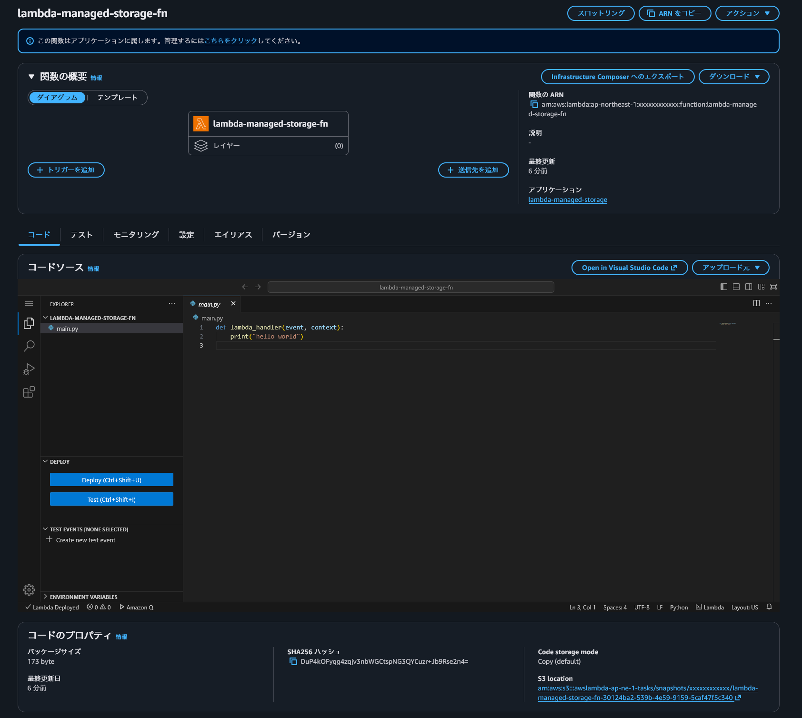
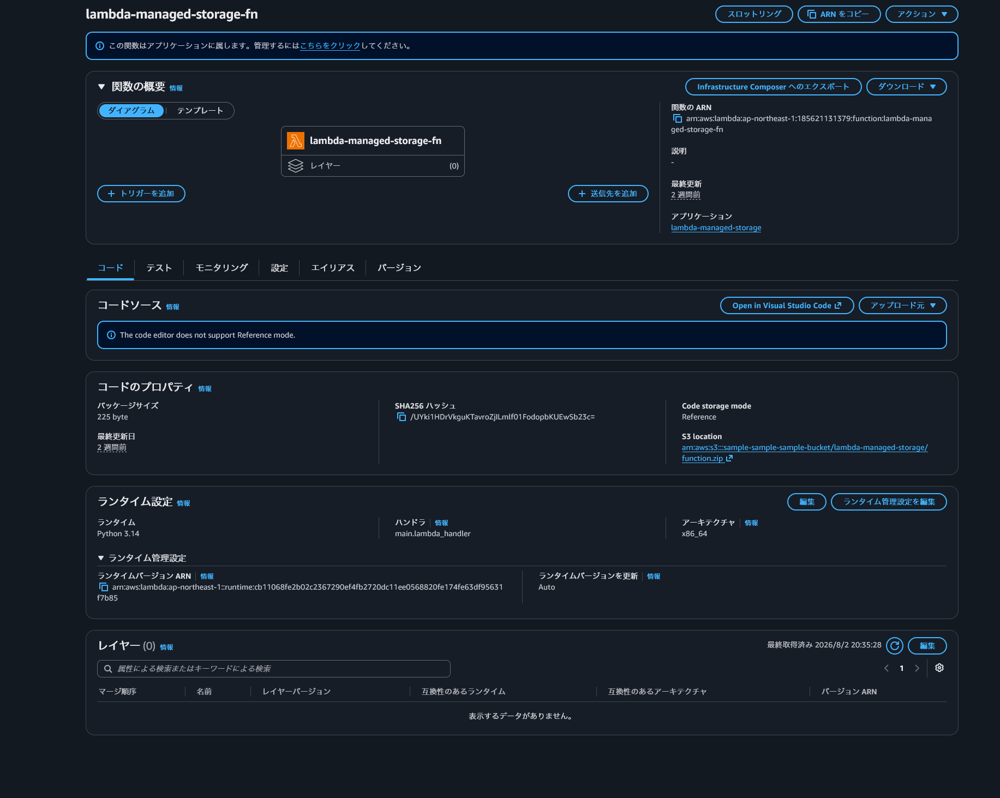

Lambda のコードのストレージに任意の S3 を指定できるようになりました！
これまでは指定できず，AWS マネージドのストレージ (直接は見えないが S3) に，コードがアップロードされていました．

リージョンごとにアップロードできる Lambda コードの合計サイズには上限があります．自分の S3 バケットを参照する場合は，コードがこの上限にカウントされません．
また，企業によっては，セキュリティチェックシートやセキュリティ要件が厳しい業界だと，自身のアカウント内にコードを収めたい需要がありました．

[リリースノート](https://aws.amazon.com/about-aws/whats-new/2026/07/lambda-self-managed-code-storage/) では，ストレージ容量しか触れられていませんでしたが，個人的にはセキュリティ要件のほうが魅力を感じます．

(リリースノートには「Lambda has increased the default limit for Lambda-managed code storage from 75GB to 300GB per Region per account.」ともありました．本稿ではその点には触れません．)

## これまでの AWS マネージドのストレージに入れている場合の状態

Lambda を触る場合は SAM のほうが圧倒的に楽ですが，現在の最新である [SAM version 1.163.0](https://github.com/aws/aws-sam-cli/releases/tag/v1.163.0) では，まだ Code storage mode を指定できませんでした．そのため，SAM テンプレートの中に CFn の `AWS::Lambda::Function` を直接書いて試します．

まず，従来の COPY モードで作成してみます．特筆すべきものはないですが，`template.yaml` は以下の通りです．

https://github.com/jjjsmz/playground/blob/7fe1b75a848aa014f228097a573cf666649c56e0/aws/lambda-managed-storage/template.yaml#L1-L31

マネコン上で見ると，以前は表示されていなかった Code storage mode という欄ができています．また，AWS の裏側でどこにコードが保持されているかわかります．
以前は CLI をたたいた時に何か見えるなあといったくらいでしたが，その抽象化されていた部分がマネコン上でも表示されるようになりました．
今回のコードは `arn:aws:s3:::awslambda-ap-ne-1-tasks/snapshots/{ACCOUNT_ID}/{FUNCTION_NAME}-{UUID}` という場所に保存されているようです．(アカウント ID は面倒ごとを避けるために伏字にしています．)



## CloudFormation で管理されているコードを移行してみる

[公式ドキュメント](https://docs.aws.amazon.com/ja_jp/lambda/latest/dg/configuration-self-managed-storage.html) によると，バケット側に必要な準備は 2 つ．

- バケットバージョニングの有効化

  どのバージョンを参照するかを指定するために必要らしい．

- バケットポリシーの設定

  Lambda のサービスプリンシパルに `s3:GetObject` と `s3:GetObjectVersion` を許可します．`aws:SourceArn` で参照元の関数を絞れるので，バケット全体を開けっ放しにする必要はありません．

    ```json bucket-policy.json
    {
    "Version": "2012-10-17",
    "Statement": [
        {
        "Sid": "LambdaSelfManagedCodeAccess",
        "Effect": "Allow",
        "Principal": { "Service": "lambda.amazonaws.com" },
        "Action": ["s3:GetObject", "s3:GetObjectVersion"],
        "Resource": "arn:aws:s3:::{BUCKET_NAME}/lambda-managed-storage/function.zip",
        "Condition": {
            "ArnLike": {
            "aws:SourceArn": "arn:aws:lambda:ap-northeast-1:{ACCOUNT_ID}:function:lambda-managed-storage-fn"
            }
        }
        }
    ]
    }
    ```

あとはテンプレートの `Code` を書き換えるだけです．ローカルのディレクトリを指していた部分を，アップロード済みの zip の位置に変えて，`S3ObjectStorageMode: REFERENCE` を付けます．

SAM の `AWS::Serverless::Function` では，`S3ObjectStorageMode` は指定できないので，CFn の `AWS::Lambda::Function` を使う必要があります．(そのうち SAM でも指定できるようになるはず...)
また，セルフマネージドストレージで管理するには，`sam deploy` より前に，S3 に zip をアップロードしておく必要があります．ここはまだ微妙に不便を感じます．

https://github.com/jjjsmz/playground/blob/b98f9b63f28fdae4573844cfb04f3123daafa222/aws/lambda-managed-storage/template.yaml#L19-L35

### 期待しすぎないほうがよい点

- zip の展開後 250 MB という上限は変わりません．増えたのはアカウント全体のコード保管量だけです
- コンテナイメージの関数は従来どおり ECR で，今回の対象外です
- Reference モードの関数は，マネジメントコンソール上のコードエディタが使えなくなります




## その他

Lambda の今後の機能追加は [AWS Lambda Roadmap](https://github.com/orgs/aws/projects/286) で公開されています．
(管理しているというより，要望を出したり眺めたりする場に近いです．)
