## はじめに

ブラウザのアドレスバーに URL を入れて Enter を押すと，数十ミリ秒後にはページが返ってきます．
裏側では NIC，カーネル，ネットワークスタック，スケジューラ，メモリアロケータ，アプリケーションプロセスが連携しています．
インフラ寄りの仕事では，「TIME_WAIT が積もって ephemeral port が枯渇した」「accept queue が溢れて接続タイムアウトが多発する」「context switch でスループットが頭打ちになる」といった現象に向き合います．

この記事では，そうした現象を「OS とハードウェアの抽象がどう積み上がっているか」から逆引きします．プロセスとファイルディスクリプタの話から始めて，ソケット，TCP/IP，MTU，I/O 多重化，並行モデルを経由し，最後に Apache，Nginx，Node.js，Go の実装を **どの抽象に賭けたか** という観点で見比べます．サンプルコードは POSIX C 風の C++ で統一し，ファイルディスクリプタは `int`，ソケット I/O は `read(2)` / `write(2)` を使います．カーネルとの境界面を見えやすくするためです．

なお HTTP/2，HTTP/3，TLS や graceful shutdown は本記事では扱いません．strace や ss は途中で登場しますが，観測ツールとしての体系的な解説はしません．

## リクエストの裏側

クライアントから 1 本の HTTP リクエストが届いたとき，上位層から並べると次のような階層が登場します．

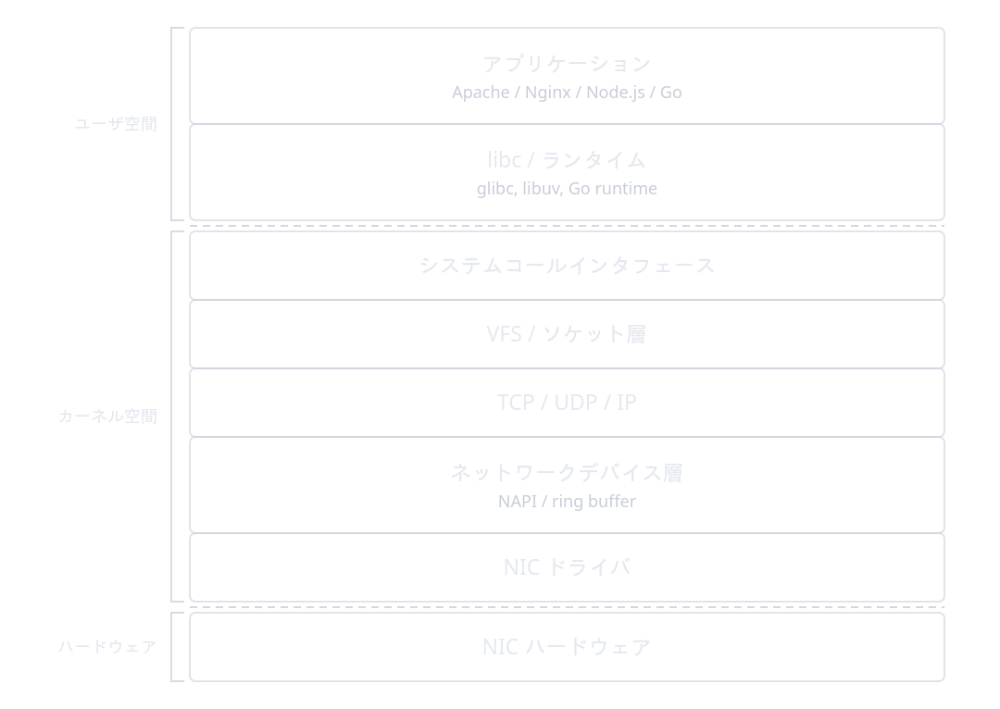

この記事ではアプリケーションコードより下，NIC ドライバの手前までを縦に貫いて見ていきます．「アプリは何を呼ぶか」と「カーネルは何をやっているか」の境界を意識すると，後で出てくる epoll や goroutine の議論が追いやすくなります．

## プロセス・スレッド・CPU と `task_struct`

Web サーバが動くということは，OS から見ればプロセスやスレッドが CPU の上で時間を割り当てられて動いている状態のことです．まずは Linux カーネルがどうタスクを表現し，どう CPU に乗せているかを見ます．

### ユーザ空間とカーネル空間

x86_64 の CPU には特権レベル (リング) があり，OS カーネルがリング 0，ユーザプロセスがリング 3 で動きます．アプリケーションが「ファイルを読む」「ソケットに書く」と言ったとき，実際にディスクや NIC を触るのはリング 0 のカーネルだけです．アプリケーションはシステムコールという決められた窓口を通じてカーネルに依頼します．

リング 3 とリング 0 の境界をまたぐにはコストがかかります．

なお，システムコールは，カーネル上で 1 つ 1 つ番号が割り当てられており，x86_64 Linux では `syscall` 命令で呼び出されます．ユーザ空間からは libc のラッパ関数を通じて呼び出されることがほとんどです．以下がシステムコールの一覧です．

https://github.com/torvalds/linux/blob/6d35786de28116ecf78797a62b84e6bf3c45aa5a/arch/x86/entry/syscalls/syscall_64.tbl

### Linux ではプロセスもスレッドも `task_struct`

Linux ではプロセスもスレッドも `task_struct` という同じ構造体で表されます．`fork(2)` も `pthread_create(3)` も内部的には `clone(2)` で `task_struct` を作っており，違いは「親と何を共有するか (CLONE_VM, CLONE_FILES, CLONE_SIGHAND…)」だけです．

`task_struct` はカーネル内部で最も大きな構造体のひとつで，`include/linux/sched.h` に定義があります．現在の Linux では[定義だけで 800 行を超えます](https://github.com/torvalds/linux/blob/06cf61899d6498b33e4b7c87d99d5bd471ccc375/include/linux/sched.h#L826-L1670)．

例として，`__state` はタスクの状態 (TASK_RUNNING, TASK_INTERRUPTIBLE, ...) を表します．`stack` はカーネルスタックへのポインタです．
`mm` はユーザ空間のアドレス空間情報へのポインタで，NULL ならカーネルスレッドです．`files` はファイルディスクリプタテーブルへのポインタ，`signal` はシグナル関連の情報へのポインタです．`cred` は資格情報へのポインタ，`comm` は実行ファイル名 ("nginx", "go" など) です．

重要なのは，**プロセスとスレッドの違いは，この構造体のうち `mm` と `files` と `signal` を共有するかどうかです**．

- `fork(2)`: ほぼ何も共有しない (CoW でメモリは最初だけ共有)
- `pthread_create(3)`: `mm`, `files`, `signal`, `fs` をすべて共有

非常に詳しい解説は man の [`clone(2)`](https://man7.org/linux/man-pages/man2/clone.2.html) にあります．

### プロセスのメモリレイアウト

x86_64 Linux のユーザプロセスの仮想アドレス空間は概ね次のようになっています．高位アドレス側がカーネル空間，低位アドレス側がコード (text) です．
ユーザ空間とカーネル空間の間に大きな穴が空いているのは，4 レベルページングでは 64 bit のうち下位 48 bit しか使わないためです (この穴のアドレスは非カノニカルと呼ばれ，触ると SIGSEGV になります)．

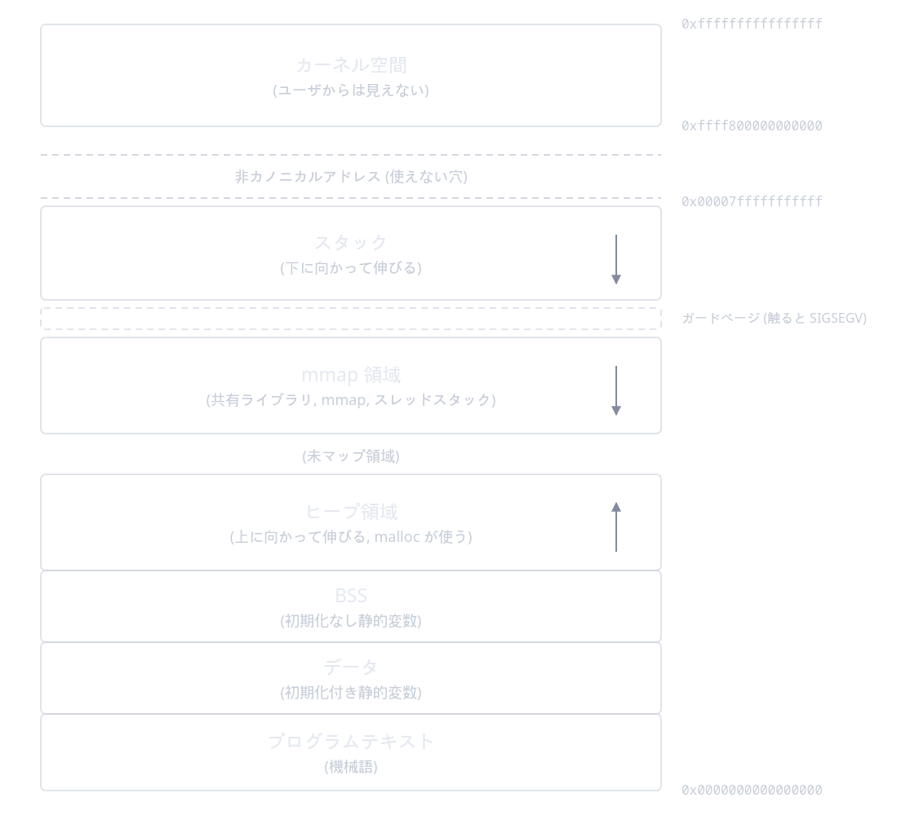

スレッドが増えるとそれぞれ独自のスタックが mmap 領域に割り当てられます．glibc 環境のデフォルトのスレッドスタックサイズは多くの場合 8MB です (`ulimit -s` で確認，`pthread_attr_setstacksize(3)` で変更可能)．「スレッドを 1 万個立てる」と言うと最大 80GB の仮想アドレス空間を確保することになり，これが C10K の素朴な解決策が破綻する理由のひとつです．このあたりのスタックの置かれ方と goroutine との対比は Dave Cheney の [Performance without the event loop](https://dave.cheney.net/2015/08/08/performance-without-the-event-loop) が読みやすいです．

### カーネルスケジューラ

Linux では長らく CFS (Completely Fair Scheduler) が使われてきましたが，カーネル 6.6 で EEVDF (Earliest Eligible Virtual Deadline First) に置き換えられました．
基本的なアイディアは「ランナブルなタスクを並べ，仮想的なランタイムが少ないものから走らせる」というもので，名前が変わってもユーザから見える性質は大きく変わりません．背景は [LWN の解説](https://lwn.net/Articles/925371/) が詳しいです．

[VA LINUX の記事](https://www.valinux.co.jp/blog/entry/20250417) を引用させていただくと，次の通り割当タイミングの工夫がなされているようです．
> CFSではnice値に応じてCPU時間を公平に割り当てる事が出来ましたが、nice値を下げても(優先度を上げても)CPU時間が多く貰えるというだけで早くCPUが割り当てられるとは限らないため、latencyという意味では必ずしもうまく機能しませんでした。
> EEVDFは、その名の通り「"eligible"なタスクなうち、"virtual deadline"が一番早いタスク」に実行権を与えますが、CPU時間をnice値に応じて公平に割り当てつつ、nice値に応じてCPUの割り当てタイミングも早くなるように工夫されていて、CFSにあったlatencyの問題も改善しようとしています。

タスクは CPU ごとの runqueue に積まれ，ロードバランサが定期的に CPU 間でタスクを移動させます．`taskset(1)` や `sched_setaffinity(2)` を使えばタスクを特定の CPU に固定 (アフィニティ) できます．

```text man 2 sched_setaffinity
SCHED_SETAFFINITY(2)
NAME
       sched_setaffinity, sched_getaffinity - set and get a thread's CPU affinity mask

SYNOPSIS
       int sched_setaffinity(pid_t pid, size_t cpusetsize,
                             const cpu_set_t *mask);
       int sched_getaffinity(pid_t pid, size_t cpusetsize,
                             cpu_set_t *mask);
```

### 動かしてみる: スレッドがどの CPU に乗っているか

```cpp thread-cpu.cpp
// g++ -O2 -pthread thread-cpu.cpp -o thread-cpu
#ifndef _GNU_SOURCE
#define _GNU_SOURCE // sched_getcpu(3) に必要 (g++ は暗黙定義する)
#endif
#include <pthread.h>
#include <sched.h>
#include <stdio.h>
#include <unistd.h>

static void *worker(void *arg)
{
    long id = (long)arg;
    for (int i = 0; i < 5; ++i)
    {
        printf("thread=%ld pthread=0x%lx cpu=%d\n",
               id, (unsigned long)pthread_self(), sched_getcpu());
        sleep(1);
    }
    return nullptr;
}

int main()
{
    pthread_t ts[4];
    for (long i = 0; i < 4; ++i)
    {
        pthread_create(&ts[i], nullptr, worker, (void *)i);
    }
    for (int i = 0; i < 4; ++i)
        pthread_join(ts[i], nullptr);
}
```

```text 実行結果
$ ./thread-cpu
thread=2 pthread=0x725eb52b66c0 cpu=13
thread=3 pthread=0x725eb4ab56c0 cpu=14
thread=0 pthread=0x725eb62b86c0 cpu=2
thread=1 pthread=0x725eb5ab76c0 cpu=18
thread=2 pthread=0x725eb52b66c0 cpu=13
thread=1 pthread=0x725eb5ab76c0 cpu=18
thread=3 pthread=0x725eb4ab56c0 cpu=4
thread=0 pthread=0x725eb62b86c0 cpu=2
thread=2 pthread=0x725eb52b66c0 cpu=13
```

実行するとスレッドがコア間を渡り歩く様子が見えます．これが OS の「タスクを CPU に振る」挙動の最も素朴な観察方法です．`taskset -c 0,1 ./thread-cpu` で固定すると CPU 0 と 1 だけで動いている様子が見えます．

```text 実行結果 (CPU 0 と 1 に固定)
$ taskset -c 0,1 ./thread-cpu
thread=0 pthread=0x755f9aa016c0 cpu=1
thread=1 pthread=0x755f9a2006c0 cpu=0
thread=2 pthread=0x755f93fff6c0 cpu=0
thread=3 pthread=0x755f999ff6c0 cpu=1
thread=0 pthread=0x755f9aa016c0 cpu=1
thread=1 pthread=0x755f9a2006c0 cpu=0
thread=3 pthread=0x755f999ff6c0 cpu=0
```

## ファイルディスクリプタとシステムコール

### fd は整数のチケット

ファイルディスクリプタ (fd) はプロセスが OS から借りる整数のチケットのようなものです．`open(2)` や `socket(2)` を呼ぶとカーネルから 0 以上の整数が返ってきて，以降 `read(2)` / `write(2)` / `close(2)` ではこの整数で「どのリソースか」を指定します．

```text man 2 open / man 2 read / man 2 write
OPEN(2)
NAME
       open, openat, creat - open and possibly create a file
SYNOPSIS
       int open(const char *pathname, int flags);
       int open(const char *pathname, int flags, mode_t mode);

       int creat(const char *pathname, mode_t mode);

       int openat(int dirfd, const char *pathname, int flags);
       int openat(int dirfd, const char *pathname, int flags, mode_t mode);
---
READ(2)
NAME
       read - read from a file descriptor

SYNOPSIS
       ssize_t read(int fd, void *buf, size_t count);
---
WRITE(2)
NAME
       write - write to a file descriptor

SYNOPSIS
       ssize_t write(int fd, const void *buf, size_t count);
```

カーネル側ではプロセスごとに `struct files_struct` があり，fd はそこへの配列インデックスとして機能します．インデックスから引いた先には `struct file` があり，さらに `struct inode` や `struct socket` を指すという二段以上の間接参照です．

https://github.com/torvalds/linux/blob/6d35786de28116ecf78797a62b84e6bf3c45aa5a/include/linux/fdtable.h#L26-L57

https://github.com/torvalds/linux/blob/6d35786de28116ecf78797a62b84e6bf3c45aa5a/include/linux/fs.h#L1260-L1300

ここに通常ファイルもパイプもソケットも eventfd も全部詰め込まれているのが Unix の「すべてはファイル」思想の正体です．

### システムコールが裏で何をしているか

ユーザ空間から `read(fd, buf, n)` を呼ぶと，glibc のラッパが引数をレジスタに並べて `syscall` 命令を発行します．x86_64 Linux なら次の流れです．

1. 呼び出し番号を `rax` に，引数を `rdi`, `rsi`, `rdx`, `r10`, `r8`, `r9` に置く
2. `syscall` 命令で CPU が特権モードに切り替わる
3. カーネルの `entry_SYSCALL_64` に飛び，システムコールテーブルを引いて実体 (`ksys_read`) を呼ぶ
4. 戻り値が `rax` に，ユーザ空間に復帰

この往復はソフトウェア的には地味ですが，1 回あたり数十〜数百ナノ秒のオーバーヘッドがあります．「システムコールはタダではない」という事実が後ほど io_uring や eBPF の設計動機になります．
また，低レイヤにおけるパフォーマンスチューニングの際には，「システムコール回数を減らす」「システムコールあたりの処理量を増やす」ことが 1 つの戦略になります．

Linux のシステムコール実装を覗くなら [Linux Inside](https://0xax.gitbooks.io/linux-insides/content/SysCall/) が読みやすいです．

### fd が多いとなぜ重いのか

`ulimit -n` で制限がかかっていることはよく知られています．Linux のディストリビューションでデフォルトは 1024 のことが多く，システム全体の上限は `/proc/sys/fs/file-max` で設定されます．

上限を上げれば確かに 1024 を超える fd を持つことはできますが，fd 数に制限がかかっているのは fd に伴うカーネルリソースの消費量が増えるからです．fd ひとつひとつにカーネル側のメモリと処理コストが付いてきます．以下に主要な負荷を並べます．

- **`struct file` 自体のメモリ**: 1 fd ごとにカーネル空間に確保されます．サイズはバージョンとコンフィグに依りますが概ね 200〜300 バイトオーダー．100 万 fd なら数百 MB になります．
- **ファイルディスクリプタテーブルの拡張**: `files_struct` は最初は小さな配列を持ち，fd 数が増えるたびに 2 倍に拡張されます．新しい配列を作って古い内容をコピーするコストがかかり，拡張中は短時間ながらロックが取られます．
- **ソケット送受信バッファ**: TCP ソケットは 1 接続ごとに送受信バッファを持ちます．サイズは `net.ipv4.tcp_rmem` (受信) と `net.ipv4.tcp_wmem` (送信) で制御されます．これらは min / default / max の 3 値で，受信側のデフォルト値はカーネル 4.20 以降 128KB，そこから自動チューニングで最大 6MB まで伸びます．メモリ自体は必要になった分しか確保されませんが，高負荷時に 1 万接続がデフォルト値まで使うと **受信側だけで 1.3GB** という規模感になります．
- **conntrack エントリ**: `iptables` や `firewalld` で NAT/フィルタを使っていると，`nf_conntrack` テーブルに接続ごとのエントリが積まれます．デフォルトで `net.netfilter.nf_conntrack_max` を超えると新規接続が DROP されます．ロードバランサ直下のサーバが「特定の時間帯だけ謎のドロップ」になる古典的な原因です．
- **epoll 登録のメモリ**: 後述する epoll は `epoll_ctl(EPOLL_CTL_ADD)` した fd ごとに `eventpoll` の管理構造を持ちます．これも 1 fd あたり百数十バイトのオーダーで，fd 数に比例して伸びます．
- **スケジューラと cache pollution**: fd 数 = 監視対象の I/O 数 が増えれば，それを処理するワーカが触るメモリ領域も広がり，L1/L2 キャッシュの取り合いが激しくなります．直接的な数値は出にくいですが，高負荷時のテールレイテンシの太りに効いてきます．

つまり fd を 100 万持つということは，単に「整数チケットが 100 万枚ある」だけではなく，**カーネル内のさまざまな構造体・バッファ・テーブルが 100 万倍される** ことを意味します．「同時 1 万接続を捌きたい」と気軽に言えるかはハードウェアと OS チューニングに大きく依存します．

実運用での確認はこのあたりです．

```text 使用中 fd / 未使用予約 / 最大値
$ cat /proc/sys/fs/file-nr
3488    0       9223372036854775807
```

```text ソケットのサマリ
$ ss -s
Total: 371
TCP:   11 (estab 1, closed 4, orphaned 0, timewait 0)

Transport Total     IP        IPv6
RAW       1         0         1
UDP       7         4         3
TCP       7         4         3
INET      15        8         7
FRAG      0         0         0
```

```text ソケットメモリの使用量
$ cat /proc/net/sockstat
sockets: used 371
TCP: inuse 4 orphan 0 tw 0 alloc 11 mem 81
UDP: inuse 4 mem 256
UDPLITE: inuse 0
RAW: inuse 0
FRAG: inuse 0 memory 0
```

```text TCP がカーネルメモリを消費する閾値 (low/pressure/high)
$ sysctl net.ipv4.tcp_mem
net.ipv4.tcp_mem = 45300        60400   90600
```

### `strace` で覗く

```text strace で Nginx のシステムコールを覗いてみる
$ sudo strace -e trace=read,write,openat $(pgrep nginx | xargs printf -- '-p %s ')
strace: Process 79456 attached
[pid 79456] openat(AT_FDCWD, "/usr/share/nginx/html/index.html", O_RDONLY|O_NONBLOCK) = 33
[pid 79456] write(7, "127.0.0.1 - - [04/May/2026:17:06"..., 160) = 160
[pid 79456] openat(AT_FDCWD, "/usr/share/nginx/html/icons/poweredby.png", O_RDONLY|O_NONBLOCK) = 33
[pid 79456] write(7, "127.0.0.1 - - [04/May/2026:17:06"..., 195) = 195
[pid 79460] openat(AT_FDCWD, "/usr/share/nginx/html/poweredby.png", O_RDONLY|O_NONBLOCK) = 33
[pid 79460] write(7, "127.0.0.1 - - [04/May/2026:17:06"..., 188) = 188
[pid 79456] openat(AT_FDCWD, "/usr/share/nginx/html/favicon.ico", O_RDONLY|O_NONBLOCK) = -1 ENOENT (No such file or directory)
[pid 79456] write(6, "2026/05/04 17:06:23 [error] 7945"..., 243) = 243
[pid 79456] write(7, "127.0.0.1 - - [04/May/2026:17:06"..., 186) = 186
```

Nginx が動いているサーバでこのように `strace` をかけると，システムコールの流れが見えます．`openat(2)` でファイルを開いている様子や，`write(2)` でアクセスログを書いている様子が見えます．

## ソケット，TCP/IP，MTU

### ソケットも結局 fd

ソケットは「ネットワーク用の特殊な fd」です．`socket(2)` で作って，`bind(2)` でローカルアドレスに紐づけ，`listen(2)` で受信状態にし，`accept(2)` で接続が来るたびに新しい fd が出てくる．これだけです．
ファイルを開くたびに fd が増えるのと同様に，接続が来るたびにソケットも fd の値も増えていきます．

```text man 2 socket / man 2 bind / man 2 listen / man 2 accept
SOCKET(2)
NAME
       socket - create an endpoint for communication

SYNOPSIS
       int socket(int domain, int type, int protocol);
---
BIND(2)
NAME
       bind - bind a name to a socket

SYNOPSIS
       int bind(int sockfd, const struct sockaddr *addr,
                socklen_t addrlen);
---
LISTEN(2)
NAME
       listen - listen for connections on a socket

SYNOPSIS
       int listen(int sockfd, int backlog);
---
ACCEPT(2)
NAME
       accept, accept4 - accept a connection on a socket

SYNOPSIS
       int accept(int sockfd, struct sockaddr *addr, socklen_t *addrlen);
       int accept4(int sockfd, struct sockaddr *addr,
                   socklen_t *addrlen, int flags);
```

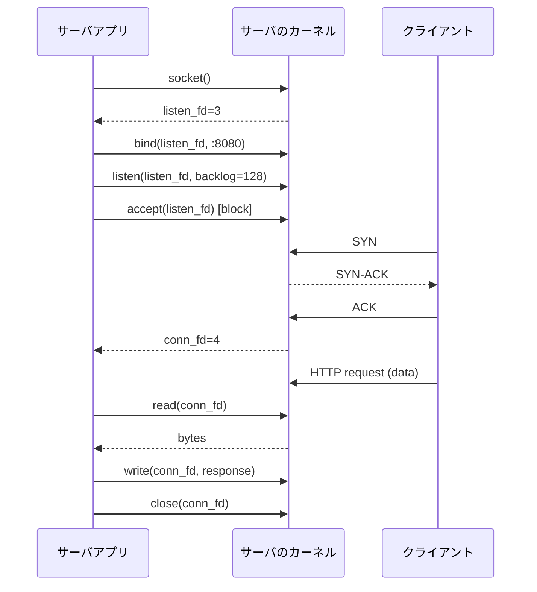

### ブロッキング echo サーバ

```cpp echo-blocking.cpp
// g++ -O2 echo-blocking.cpp -o echo-blocking
#include <arpa/inet.h>
#include <netinet/in.h>
#include <sys/socket.h>
#include <unistd.h>
#include <stdio.h>
#include <string.h>

int main()
{
    int listen_fd = socket(AF_INET, SOCK_STREAM, 0);
    int yes = 1;
    setsockopt(listen_fd, SOL_SOCKET, SO_REUSEADDR, &yes, sizeof(yes));

    sockaddr_in addr{};
    addr.sin_family = AF_INET;
    addr.sin_addr.s_addr = htonl(INADDR_ANY);
    addr.sin_port = htons(8080);
    bind(listen_fd, (sockaddr *)&addr, sizeof(addr));
    listen(listen_fd, 128);

    for (;;)
    {
        int conn_fd = accept(listen_fd, nullptr, nullptr);
        char buf[4096];
        ssize_t n;
        while ((n = read(conn_fd, buf, sizeof(buf))) > 0)
        {
            write(conn_fd, buf, n);
        }
        close(conn_fd);
    }
}
```

このサーバは 1 接続ずつしか処理できません．`accept` から返ってきたあと `read` でブロックしている間，他のクライアントは待たされます．これを並行に処理する方法を順に積み上げていくのが本記事の後半の主題です．

### TCP の 3-way handshake と 2 段のキュー

TCP の接続確立は SYN / SYN-ACK / ACK の 3 パケットで行われます．カーネルはこの過程で 2 つのキューを使います．


- **SYN queue (半接続キュー，SYN_RECV 状態)**: SYN を受けて SYN-ACK を返したが，まだ ACK が来ていない接続
- **accept queue (完全接続キュー，ESTABLISHED 状態)**: 3-way が完了し，アプリの `accept(2)` を待っている接続

それぞれの上限はこうなっています．

- SYN queue: `net.ipv4.tcp_max_syn_backlog`
- accept queue: `min(net.core.somaxconn, listen() の backlog 引数)`

accept queue が溢れるとカーネルは ACK を黙って捨てたり (デフォルト) RST を返したりします (`net.ipv4.tcp_abort_on_overflow=1`)．前者ではクライアントは「接続できた」と思い込んだまま応答を待ち続けてタイムアウトし，後者では connection reset になります．本番で原因不明のタイムアウトや reset が頻発したとき，まずここを疑います．現状を見るには `ss` コマンドが便利です．

```sh
ss -lnt                              # listen ソケットの Recv-Q (現在の accept queue 長) と Send-Q (上限)
ss -tan state syn-recv | wc -l       # SYN queue にいる接続数
```

SYN flood 攻撃に対する防御として `net.ipv4.tcp_syncookies` がありますが，これは SYN queue を実質無限にする魔法ではなく，queue が溢れたときだけ ACK 応答に必要な情報を Cookie に詰め込んで「ステートレス」に応答するテクニックです．[Cloudflare の解説](https://blog.cloudflare.com/syn-packet-handling-in-the-wild/) が具体的で参考になります．

ただし，NW 屋さんでない限りは，この辺りはクラウド事業者側でやってくれていることが多いので，実際に L4 レベルでの対策をやることは多くないかと思います．

### TIME_WAIT と ephemeral port

接続を閉じた側 (能動的クローズ) は **TIME_WAIT** 状態に入り，遅延した古いパケットが新しい接続に紛れ込まないよう一定時間 (Linux では `TCP_TIMEWAIT_LEN` = 60 秒固定) 待ちます．大量の短命接続を作る側 (例えば API ゲートウェイから上流を叩くクライアント) はこの状態の接続が積もり，ephemeral port (`net.ipv4.ip_local_port_range`) が枯渇する事故が発生します．

TCP の状態遷移は非常に複雑で，本稿では主題から外れるため詳細は割愛しますが，[RFC 9293 の 3.3.2](https://datatracker.ietf.org/doc/html/rfc9293#section-3.3.2) にて定義されています．

対策はクライアント側を keep-alive で再利用する，ephemeral 範囲を広げる，など．外向き接続に限れば `net.ipv4.tcp_tw_reuse` の有効化も選択肢になります (TCP タイムスタンプで安全を確認できた TIME_WAIT ポートだけを再利用する)．NAT 環境を壊すことで有名だったのは `net.ipv4.tcp_tw_recycle` のほうで，こちらは危険すぎて Linux 4.12 で削除されました．[Vincent Bernat の "Coping with the TCP TIME-WAIT state on busy Linux servers"](https://vincent.bernat.ch/en/blog/2014-tcp-time-wait-state-linux) は今なお実務的にも役立つ解説です．

### IP 層と MTU: クラウド環境では特に厄介

IP 層では MTU を超えるパケットがフラグメント化されます．イーサネットの標準 MTU は 1500 で，TCP/IP ヘッダ 40 バイトを引いた MSS は 1460 が標準的です．ところが現実には，経路の途中で MTU が変わったり，トンネリングで MTU が削られたり，クラウド事業者によってデフォルトが違ったりして，ここが Web サーバ運用の地味な落とし穴になります．

**経路ごとの MTU 上限** を主な公式ドキュメントから整理します．AWS の「既定 MTU」はインスタンスタイプと OS に依存し，公式ドキュメントも断定していません (VPC 内の Amazon Linux + ENA では 9001 になるのが実態です)．

| 環境                                    | MTU 上限                        | 備考                                                                                                                          |
| --------------------------------------- | ------------------------------- | ----------------------------------------------------------------------------------------------------------------------------- |
| AWS VPC 内                              | 9001                            | 全タイプ 1500 対応，現行世代は 9001 対応 ([EC2 の MTU](https://docs.aws.amazon.com/AWSEC2/latest/UserGuide/network_mtu.html)) |
| AWS VPC ピアリング (同一リージョン)     | 9001                            | [VPC ピアリングの基礎](https://docs.aws.amazon.com/vpc/latest/peering/vpc-peering-basics.html)                                |
| AWS VPC ピアリング (リージョン間) / TGW | 8500                            |                                                                                                                               |
| AWS IGW・VPN 経由，TGW なしリージョン間 | 1500                            | インターネット向けは 1500 が推奨と明記                                                                                        |
| GCP VPC                                 | 既定 1460，1300 ~ 8896 を選択可 | [VPC の MTU](https://cloud.google.com/vpc/docs/mtu)                                                                           |
| WireGuard / IPsec トンネル              | 1420 前後                       | 暗号化と追加ヘッダ分削られる                                                                                                  |

ジャンボフレーム (MTU 9001 など) を使うとパケットあたりのヘッダ比率が下がり，スループットと CPU 効率が改善します．大量の内部通信が走るバッチ処理や分散ストレージで効きます．一方で **経路上のすべてが対応していないと使えません**．インスタンスは 9001 設定でも，ロードバランサや IGW を経由するときに 1500 にクランプされることがあります．

トラブルが起きるのは，経路の途中で MTU が小さくなる箇所がある場合です．
パケットの DF ビットが立っているとき (TCP は通常立てる)，ルータは「Fragmentation Needed (ICMP type 3 code 4)」を返すべきです．
しかし，ファイアウォールでこの ICMP が DROP されていると **PMTUD ブラックホール** に陥り，TCP は再送を繰り返してハングしたように見えます．
具体的には「最初のリクエストは通るのに，大きなレスポンスや POST が固まる」という症状になります．

実用上の処方箋は次のあたりです．

- **MSS クランピング**: 受信した TCP SYN の MSS オプションを経路の最小 MTU - 40 に書き換える．Linux なら `iptables -t mangle -A FORWARD -p tcp --tcp-flags SYN,RST SYN -j TCPMSS --clamp-mss-to-pmtu`．クラウドのマネージド NAT ゲートウェイや LB は通常自動でやってくれます
- **MTU 既定値を確認**: `ip link show`，`tracepath <相手>` で経路の MTU を測定
- **PMTUD ブラックホール検知**: `net.ipv4.tcp_mtu_probing=1` を有効にすると，ブラックホールを検知して MSS を自動調整してくれる
- **クラスタ内 MTU の統一**: Kubernetes ではノード間ネットワークの MTU と CNI プラグインのオーバヘッドを合わせて Pod の MTU を決める．ズレると Pod 間通信だけ謎に固まる

「クラウドだから何も気にしなくていい」のはおおむね真ですが，**VPN，IPIP，VXLAN，ピアリング，クロスリージョン** が入った瞬間に MTU の話に巻き込まれます．既定で 1500 / MSS 1460 を保てる範囲なら何もしなくていい，それ以外は意識する，くらいの感覚で良いです．

### ネットワークスタックの全景

Linux のパケット受信パスは複雑で，[冒頭の階層図](#リクエストの裏側) の「ネットワークデバイス層」から上を，NIC の割り込み，NAPI，ソフトウェア IRQ，バックログキュー，プロトコル層と経由して登っていきます．[Cloudflare のブログ](https://blog.cloudflare.com/how-to-receive-a-million-packets/) には実装レベルで詳しい図があります．古典的な良記事で，RPS / RFS などのカーネルパラメータと数値感を一緒に学べます．

カーネル側の TCP 実装を直接眺めたい場合は `net/ipv4/tcp_input.c` のコメントが教科書代わりになります．
https://github.com/torvalds/linux/blob/master/net/ipv4/tcp_input.c

## Unix ドメインソケットと IPC

### AF_UNIX

同一ホスト上の 2 プロセスが通信するなら，TCP よりも Unix ドメインソケット (AF_UNIX) が高速かつ安全です．パケット化もチェックサムもルーティングも不要で，カーネル内のメモリコピーだけで済みます．

API は AF_INET とほぼ同じで，`bind(2)` のアドレスがファイルパス (`sockaddr_un.sun_path`) になる点だけが違います．

```cpp
sockaddr_un addr{};
addr.sun_family = AF_UNIX;
strncpy(addr.sun_path, "/tmp/myapp.sock", sizeof(addr.sun_path) - 1);
bind(fd, (sockaddr*)&addr, sizeof(addr));
```

`SOCK_STREAM` (TCP 風)，`SOCK_DGRAM` (UDP 風)，`SOCK_SEQPACKET` (境界付きストリーム) の 3 種類があり，Linux 限定で **abstract socket** (パスがファイルシステムに作られず `\0` 始まり) も使えます．

```text man 7 unix
UNIX(7)

NAME
       unix - sockets for local interprocess communication

SYNOPSIS
       #include <sys/socket.h>
       #include <sys/un.h>

       unix_socket = socket(AF_UNIX, type, 0);
       error = socketpair(AF_UNIX, type, 0, int *sv);

DESCRIPTION
       The  AF_UNIX  (also known as AF_LOCAL) socket family is used to communicate between processes
       on the same machine efficiently.  Traditionally, UNIX domain sockets can be  either  unnamed,
       or  bound  to a filesystem pathname (marked as being of type socket).  Linux also supports an
       abstract namespace which is independent of the filesystem.

       Valid socket types in the  UNIX  domain  are:  SOCK_STREAM,  for  a  stream-oriented  socket;
       SOCK_DGRAM, for a datagram-oriented socket that preserves message boundaries (as on most UNIX
       implementations, UNIX domain datagram sockets are always reliable  and  don't  reorder  data‐
       grams); and (since Linux 2.6.4) SOCK_SEQPACKET, for a sequenced-packet socket that is connec‐
       tion-oriented, preserves message boundaries, and delivers messages in  the  order  that  they
       were sent.

       UNIX  domain  sockets  support  passing file descriptors or process credentials to other pro‐
       cesses using ancillary data.
```

### SCM_RIGHTS で fd を渡す

AF_UNIX 経由なら，ファイルディスクリプタそのものを別プロセスに渡せます (`SCM_RIGHTS`)．`sendmsg(2)` の補助データに fd を載せると，受け取った側のプロセスでも同じカーネルオブジェクトを指す fd として有効になります．

```text man 2 send / man 2 recv
SEND(2)
NAME
       send, sendto, sendmsg - send a message on a socket

SYNOPSIS
       ssize_t send(int sockfd, const void *buf, size_t len, int flags);

       ssize_t sendto(int sockfd, const void *buf, size_t len, int flags,
                      const struct sockaddr *dest_addr, socklen_t addrlen);

       ssize_t sendmsg(int sockfd, const struct msghdr *msg, int flags);
---
RECV(2)
NAME
       recv, recvfrom, recvmsg - receive a message from a socket

SYNOPSIS
       ssize_t recv(int sockfd, void *buf, size_t len, int flags);

       ssize_t recvfrom(int sockfd, void *buf, size_t len, int flags,
                        struct sockaddr *src_addr, socklen_t *addrlen);

       ssize_t recvmsg(int sockfd, struct msghdr *msg, int flags);
```

listen fd を別プロセスに引き継ぐ手段としては fork/exec 時の **fd 継承** もあります．systemd socket activation (systemd が作った listen ソケットを起動したアプリに渡す) や Nginx の reload (fork した worker に listen fd を継承させる) はこちらです．SCM_RIGHTS の強みは **親子関係のないプロセス間でも fd を渡せる** ことで，例えば次のように使われます．

- **Envoy の hot restart**: 旧プロセスから新プロセスへ Unix ソケット経由で listen fd を渡し，無停止で再起動する
- **HAProxy の seamless reload**: 新プロセスが旧プロセスの保持する listen fd を Unix ソケット経由で受け取り，接続を落とさず設定を反映する

### 他の IPC

選択肢は色々あります．

- **パイプ (`pipe(2)`)**: 単方向，親子間で使う
- **名前付きパイプ / FIFO (`mkfifo(3)`)**: ファイルシステム上に名前を持つパイプ
- **共有メモリ (`shm_open(3)` + `mmap(2)`)**: 高速だが同期は自前 (futex，セマフォ等)
- **POSIX メッセージキュー (`mq_open(3)`)**: 境界つきメッセージ，カーネル内バッファリング
- **シグナル**: 1 ビットの非同期通知，できることは少ない
- **eventfd / signalfd / timerfd**: 「カウンタ」「シグナル」「タイマ」を fd として表現する Linux 拡張．epoll に組み込みやすい

実例を挙げると，Docker の `/var/run/docker.sock` は Unix ドメインソケットで，dockerd と CLI / SDK の間の HTTP を通しています．PostgreSQL や MySQL も同じホストでの接続には Unix ソケットを推奨しています (TCP よりレイテンシが低く，peer authentication で OS のユーザを認証に使えるため)．

## ブロッキング I/O から始める並行サーバ

最もナイーブなアプローチから始めて，限界を見ていきます．

### 1 接続 = 1 プロセス (`fork`)

[ブロッキング echo サーバ](#ブロッキング-echo-サーバ) 例を示しましたが，これでは 1 接続ずつしか処理できませんでした．
そこで，複数のクライアントを同時に捌くための最も古典的なモデルの，accept したら fork してその子に任せる方法を見てみましょう．

```cpp echo-fork.cpp
// g++ -O2 echo-fork.cpp -o echo-fork
#include <sys/socket.h>
#include <netinet/in.h>
#include <unistd.h>
#include <signal.h>
#include <stdio.h>

static void handle(int conn_fd)
{
    char buf[4096];
    ssize_t n;
    while ((n = read(conn_fd, buf, sizeof(buf))) > 0)
    {
        write(conn_fd, buf, n);
    }
    close(conn_fd);
}

int main()
{
    signal(SIGCHLD, SIG_IGN); // ゾンビ回避

    int listen_fd = socket(AF_INET, SOCK_STREAM, 0);
    int yes = 1;
    setsockopt(listen_fd, SOL_SOCKET, SO_REUSEADDR, &yes, sizeof(yes));
    sockaddr_in addr{AF_INET, htons(8080), {htonl(INADDR_ANY)}, {}};
    bind(listen_fd, (sockaddr *)&addr, sizeof(addr));
    listen(listen_fd, 128);

    for (;;)
    {
        int conn_fd = accept(listen_fd, nullptr, nullptr);
        if (conn_fd < 0)
            continue;

        pid_t pid = fork();
        if (pid == 0)
        {
            close(listen_fd);
            handle(conn_fd);
            _exit(0);
        }
        close(conn_fd); // 親は不要
    }
}
```

利点は単純さと，モジュール (CGI スクリプトなど) が thread-unsafe でも動かせる点．欠点は `fork(2)` のコストとプロセスのメモリ消費です．Linux の `fork` はコピーオンライトで物理メモリを最初は共有しますが，ページテーブルそのものはコピーされるためプロセスサイズが大きいほど遅くなります．

### 1 接続 = 1 スレッド

スレッドはプロセスより軽いですが，[前述のとおり](#プロセスのメモリレイアウト) 1 万本立てれば仮想アドレス空間 80GB です．スタックを 256KB などに絞れば現実的になりますが，スタックオーバーフローのリスクと表裏一体です．

### プールするという発想

1 接続ごとに作り捨てするのではなく，あらかじめ N 個のワーカ (プロセスまたはスレッド) を起動しておいてキューから取り出す **pre-fork** / **thread pool** モデルがあります．Apache の prefork / worker MPM はまさにこの系譜で，後で詳しく見ます．

ただしこれでも N の上限があり，それ以上の同時接続では誰かが待たされます．「N をどんどん増やしていけば良いのでは?」という素朴な発想が次の章で粉砕されます．

## C10K 問題とコンテキストスイッチのコスト

### C10K 問題

1999 年に Dan Kegel が発表した有名なエッセイ ["The C10K problem"](http://www.kegel.com/c10k.html) が問題提起の原典です．

要旨: 「1 台のサーバで 1 万同時接続を処理するには，OS とサーバ実装の両方で工夫が必要」．当時はハードウェアではなくソフトウェアアーキテクチャがボトルネックでした．現代では C10K は当たり前で，議論は C10M (1 千万) に移っていますが，根っこの考え方は同じです．[Robert Graham の C10M](https://www.youtube.com/watch?v=73XNtI0w7jA) も視野が広がります．

### なぜ thread-per-connection は破綻するか

3 つの壁があります．

**メモリの壁**: 前述のとおりスレッドスタック × N で仮想アドレス空間と物理メモリを食います．

**スケジューラの壁**: ランナブルなタスクが N 万個あっても CPU はせいぜい数十コアです．スケジューラはタスクをかわるがわる CPU に乗せますが，タスク数が多いほど 1 タスクあたりの CPU 時間が短くなり，後述のスイッチコストが相対的に大きくなります．

**コンテキストスイッチの壁**: ここが最も重要です．

### コンテキストスイッチのコスト

スレッド A から B への切り替えで何が起きるかを並べると次のとおりです．

1. 汎用レジスタ・FPU レジスタ・SSE/AVX レジスタの保存
2. カーネルモードへの遷移 (タイマ割り込みやシステムコール経由)
3. スケジューラが次のタスクを選ぶ
4. アドレス空間が変わる場合 **TLB のフラッシュ** (PCID で部分的に回避できる)
5. 新タスクのレジスタを復元してユーザモードへ

レジスタ保存自体は数十ナノ秒で終わりますが，真に高いのは間接的なコストです．新しいタスクは L1 / L2 キャッシュにコードもデータも乗っていないので，復帰直後はキャッシュミスを連発しながら走ります．古い研究では「OS スレッドのコンテキストスイッチは数 μs オーダー，キャッシュ効果まで含めると数十 μs に達する」とされています (測定環境とワークロードに大きく依存します)．

ナノ秒換算で 1 μs = 1000ns．CPU クロックが 3GHz なら 3000 サイクル分の仕事ができます．これを毎接続ごとに何回か払うとなると，スループットがすぐに頭打ちになります．
コンテキストスイッチをより深く理解したいなら，以下の記事がお勧めです．
https://www.brendangregg.com/blog/2018-02-09/kpti-kaiser-meltdown-performance.html

### 計測

```text コンテキストスイッチ数
$ vmstat 1                  # cs 列が 1 秒あたりのコンテキストスイッチ数
procs -----------memory---------- ---swap-- -----io---- -system-- -------cpu-------
 r  b   swpd   free   buff  cache   si   so    bi    bo   in   cs us sy id wa st gu
 1  0      0 8500936  6808 1381740   0    0    99   112 1101    0  0  0 99  0  0  0
 0  0      0 8662656  6808 1381740   0    0     0     0  511  637  0  0 100 0  0  0
 0  0      0 8661324  6808 1381740   0    0     0     0 10008 17387 1 3 95  0  0  0
 0  0      0 8661324  6808 1381740   0    0     0     0  434  568  0  0 100 0  0  0
 2  0      0 8655128  6816 1381732   0    0     0    44 6045 10463 1  2 98  0  0  0
 0  0      0 8658020  6816 1381732   0    0     0     0 4302 7214  1  1 98  0  0  0
 0  0      0 8656976  6816 1381732   0    0     0     0 1993 3293  0  1 99  0  0  0
 0  0      0 8659064  6816 1381732   0    0     0     0  348  548  0  0 100 0  0  0
 0  0      0 8660224  6816 1381732   0    0     0     0 1832 3173  0  0 100 0  0  0
 0  0      0 8659436  6824 1381724   0    0     0    24 4540 7453  0  1 98  0  0  0
 0  0      0 8662440  6824 1381724   0    0     0     0 6285 10637 1  2 97  0  0  0
 0  0      0 8661940  6824 1381724   0    0     0     0  322  389  0  0 100 0  0  0
 5  0      0 8663056  6824 1381724   0    0     0     0 2122 3690  1  0 99  0  0  0
```
```sh
pidstat -w -p $(pgrep -n nginx) 1   # cswch/s = 自発的, nvcswch/s = 強制的
perf stat -e context-switches,cpu-migrations -p $PID
```

「context switch が秒間 10 万を超えてきたら危険信号」というのが目安としてよく使われます．

## I/O 多重化: select / poll / epoll / io_uring

ここまでで「スレッドを増やすだけでは無理」と分かりました．次の発想は「1 つのスレッドで複数の fd を見張る」ことです．これを I/O 多重化と呼びます．歴史を辿ると，同じ問題に対して API がどう進化してきたかが見えてきます．

### select(2) と poll(2) — O(N) の限界

すごく古い API である `select(2)` は監視したい fd を `fd_set` (ビットマップ) に立てて渡すと，どれかが ready になるまでブロックします．問題は次のとおり．

- `FD_SETSIZE` が 1024 (Linux のデフォルト)
- 呼び出すたびに全 fd のビットマップをカーネルに渡す必要がある
- カーネルも全 fd を線形にスキャンする → O(N)

`poll(2)` は `pollfd` 配列を渡す方式で fd 数の上限は緩和されましたが，呼ぶたびに全エントリをカーネルに渡してカーネルが全部スキャンする O(N) 性は変わりません．1 万接続では現実的ではありません．

### epoll(7) — Linux の主役

Linux 2.5.44 (2002 年) で追加された，状態を持つ I/O 多重化 API．API は 3 つだけです．

```text man 2 epoll_create / man 2 epoll_ctl / man 2 epoll_wait
EPOLL_CREATE(2)

NAME
       epoll_create, epoll_create1 - open an epoll file descriptor

SYNOPSIS
       int epoll_create(int size);
---
EPOLL_CTL(2)

NAME
       epoll_ctl - control interface for an epoll file descriptor

SYNOPSIS
       int epoll_ctl(int epfd, int op, int fd, struct epoll_event *event);
---
EPOLL_WAIT(2)

NAME
       epoll_wait, epoll_pwait - wait for an I/O event on an epoll file descriptor

SYNOPSIS
       int epoll_wait(int epfd, struct epoll_event *events,
                      int maxevents, int timeout);
       int epoll_pwait(int epfd, struct epoll_event *events,
                      int maxevents, int timeout,
                      const sigset_t *sigmask);
```

`epoll_ctl` で「監視リスト」をカーネル内に登録し，`epoll_wait` は **ready になった fd だけ** を返します．カーネル内ではコールバックと ready list で管理されているため，ready の fd 数を K として O(K) で済みます．N 個監視していても K が小さければ高速です．実装は Linux カーネルの `fs/eventpoll.c` にあります．

https://github.com/torvalds/linux/blob/master/fs/eventpoll.c

epoll の重要な選択肢が **LT (level-triggered，デフォルト) と ET (edge-triggered，`EPOLLET` 指定)** です．

- **LT**: ソケットに読めるデータがある間，`epoll_wait` は何度でも通知する (`poll(2)` と同じセマンティクス)
- **ET**: 「読めない → 読める」「書けない → 書ける」の **エッジ** (状態遷移) でしか通知しない

ET の方が `epoll_wait` の呼び出し回数を減らせて高速ですが，「通知が来たら EAGAIN になるまで読み切る」アプリ側の責任が重くなります．Nginx は ET，libuv は LT，Go の netpoller は ET です (`netpoll_epoll.go` で `EPOLLET` を指定しています)．

実際に動作するサーバはこんな形になります．

```cpp echo-epoll.cpp
// g++ -O2 echo-epoll.cpp -o echo-epoll
#include <sys/socket.h>
#include <sys/epoll.h>
#include <netinet/in.h>
#include <fcntl.h>
#include <unistd.h>
#include <stdio.h>
#include <errno.h>

int main()
{
    int listen_fd = socket(AF_INET, SOCK_STREAM | SOCK_NONBLOCK, 0);
    int yes = 1;
    setsockopt(listen_fd, SOL_SOCKET, SO_REUSEADDR, &yes, sizeof(yes));
    sockaddr_in addr{AF_INET, htons(8080), {htonl(INADDR_ANY)}, {}};
    bind(listen_fd, (sockaddr *)&addr, sizeof(addr));
    listen(listen_fd, 1024);

    int epfd = epoll_create1(EPOLL_CLOEXEC);
    epoll_event ev{};
    ev.events = EPOLLIN;
    ev.data.fd = listen_fd;
    epoll_ctl(epfd, EPOLL_CTL_ADD, listen_fd, &ev);

    epoll_event events[256];
    char buf[4096];

    for (;;)
    {
        int n = epoll_wait(epfd, events, 256, -1);
        for (int i = 0; i < n; ++i)
        {
            int fd = events[i].data.fd;
            if (fd == listen_fd)
            {
                while (true)
                {
                    int conn_fd = accept4(listen_fd, nullptr, nullptr, SOCK_NONBLOCK);
                    if (conn_fd < 0)
                    {
                        if (errno == EAGAIN || errno == EWOULDBLOCK)
                            break;
                        perror("accept4");
                        break;
                    }
                    epoll_event cev{};
                    cev.events = EPOLLIN;
                    cev.data.fd = conn_fd;
                    epoll_ctl(epfd, EPOLL_CTL_ADD, conn_fd, &cev);
                }
            }
            else
            {
                ssize_t r = read(fd, buf, sizeof(buf));
                if (r <= 0)
                {
                    epoll_ctl(epfd, EPOLL_CTL_DEL, fd, nullptr);
                    close(fd);
                }
                else
                {
                    write(fd, buf, r);
                }
            }
        }
    }
}
```

スレッドは 1 本のままで，数千接続を 1 コアで捌けます．これが「1 スレッド N 接続」の基本形で，Nginx と Node.js (libuv) の心臓部です．

### kqueue (BSD/macOS)

FreeBSD と macOS には `kqueue(2)` があります．epoll と思想は近く，ファイル変更通知やシグナル，タイマも統一的に扱える点でやや汎用です．libuv はプラットフォームごとに epoll / kqueue / IOCP を切り替えています．

### io_uring (Linux 5.1+) — 「完了」モデルへの転換

epoll は「どの fd が ready か」を教えてくれるだけで，実際の `read` / `write` システムコールは依然として個別に呼ぶ必要があります．**io_uring** はこれを根本から変え，**「サブミットキュー (SQ) と完了キュー (CQ) の 2 本のリングバッファ経由でカーネルに非同期 I/O を投入する」** モデルを採用しました．

```text man 2 io_uring_setup / man 2 io_uring_enter
io_uring_setup(2)
       int io_uring_setup(unsigned entries, struct io_uring_params *p);

io_uring_enter(2)
       int io_uring_enter(unsigned int fd, unsigned int to_submit,
                          unsigned int min_complete, unsigned int flags,
                          sigset_t *sig);
```

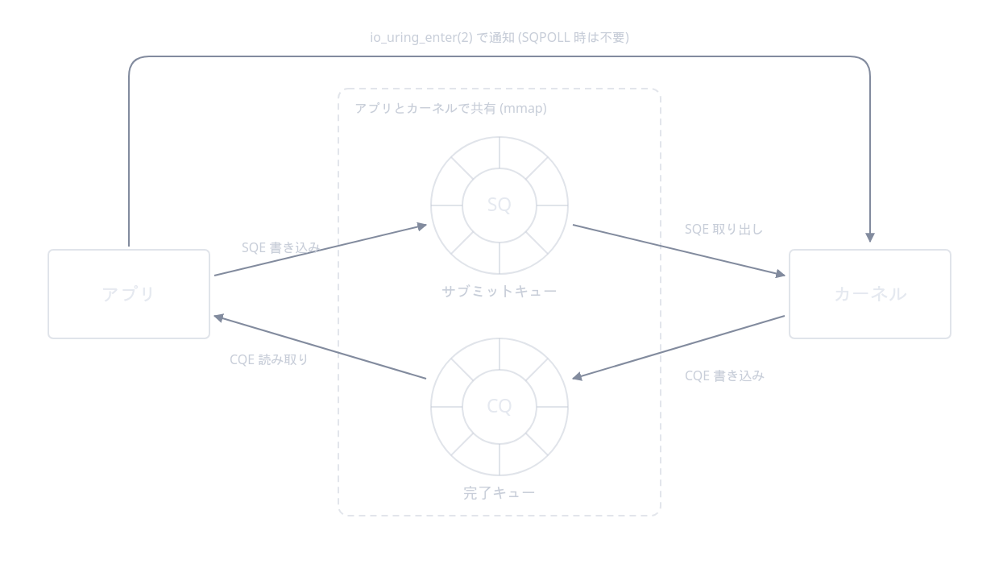

特徴を並べます．

- 1 回の `io_uring_enter` で複数の I/O 操作を投入できる (バッチング)
- カーネルポーリングモード (`SQPOLL`) ではユーザは SQ に書くだけでカーネルが拾ってくれる．**システムコール 0 回** で I/O を発行できる
- ファイル I/O も真に非同期 (epoll はソケットなど一部の fd でしか機能せず，ファイル I/O は事実上同期だった)

設計思想は作者 Jens Axboe の ["Efficient IO with io_uring"](https://www.kernel.dk/io_uring.pdf) が一次資料です．[LWN の入門記事](https://lwn.net/Articles/776703/) も併読推奨です．ライブラリ [`liburing`](https://github.com/axboe/liburing) を使うと組みやすくなります．ScyllaDB や近年の高速ストレージ・プロキシは積極的に採用しています．

### Windows IOCP

Windows には I/O Completion Ports (IOCP) があり，「完了」ベースの API という点では io_uring に近い設計です．本記事は Linux 中心なので名前だけ触れるにとどめます．

## 並行モデルのバリエーション

epoll を持つことで「1 スレッドで多数の接続を捌く」が可能になりました．ここから先は **複数 CPU をどう活用するか** の話で，アーキテクチャがいくつかに分かれます．

**シングルスレッドイベントループ**: 1 つのプロセスに 1 本のイベントループ．Node.js のデフォルト，Nginx の各 worker の中身．シンプルで CPU キャッシュ局所性が良いですが，**CPU 1 コアしか使えない** ので，スケールするには複数プロセスを束ねる必要があります．

**イベントループ + ワーカースレッドプール**: イベントループをブロックしうる仕事 (CPU バウンドな圧縮・暗号化や，非同期化しにくいファイル I/O) はメインループから別のスレッドに退避させる構成．Node.js の `libuv` は内部スレッドプール (デフォルト 4 スレッド，`UV_THREADPOOL_SIZE`) を持ち，ファイル I/O や DNS 解決をそこに流します．

**マルチプロセスイベントループ + SO_REUSEPORT**: CPU コア数だけプロセスを立て，各プロセスがイベントループを持つ．Linux 3.9 から使える **SO_REUSEPORT** は同じポートを複数のソケットで listen でき，カーネルがコネクションを 4-tuple のハッシュで分散します．これにより accept ロックが不要になり，スケールがリニアに伸びます．Nginx (`reuseport` ディレクティブ)，Envoy が採用．LWN の解説: https://lwn.net/Articles/542629/

**M:N グリーンスレッド**: OS のスレッド (M 本) の上にユーザランドの軽量スレッド (N 本，N >> M) を多重化するモデル．Go の goroutine と Java 21 の Virtual Threads が代表例です．アプリは「軽量スレッドが数十万あって普通」な世界観でブロッキング風のコードを書け，ランタイムが裏で epoll を呼んでブロックしているように見せかけます．「同期コードの書き心地」と「非同期 I/O のスループット」を両立する野心的なモデルです．

**アクターモデル**: Erlang/OTP, Akka, Elixir はメッセージパッシングを基本とするアクターモデルを採用しています．状態の共有を排除することで並行性のバグを減らす方向性で，WhatsApp が「200 万同時接続を 1 ノードで」と発表したのは Erlang VM の上です．

これらをまとめるとこうなります．

| モデル                         | 代表                   | CPU 並列 | I/O 多重化        | コーディング               |
| ------------------------------ | ---------------------- | -------- | ----------------- | -------------------------- |
| 1 接続 1 プロセス (fork)       | 古典 CGI               | 〇       | × (ブロック)      | 単純                       |
| 1 接続 1 スレッド              | Apache worker (の一部) | 〇       | × (ブロック)      | 単純だが共有注意           |
| シングルスレッドイベントループ | Node.js                | ×        | 〇 (epoll)        | コールバック / async-await |
| マルチプロセスイベントループ   | Nginx, Envoy           | 〇       | 〇 (epoll)        | コールバック               |
| M:N グリーンスレッド           | Go, Erlang, Java 21    | 〇       | 〇 (内部で epoll) | 同期風                     |

## 実装を覗く: Apache / Nginx / Node.js / Go

### Apache httpd

Apache は **MPM (Multi-Processing Module)** という抽象でリクエスト処理戦略を差し替える設計です．主要な 3 つを並行モデルの進化として並べると次のようになります．リポジトリは https://github.com/apache/httpd で，実装の中心は https://github.com/apache/httpd/blob/trunk/server/mpm/event/event.c です．

#### prefork MPM

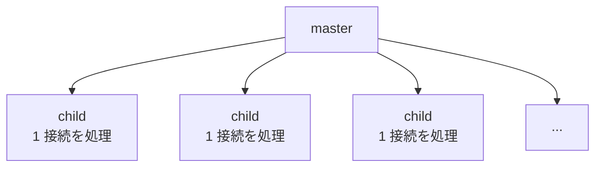

master が起動時に複数の子プロセスを fork し，各子が **1 接続だけ** を担当します (処理が終わると次の接続を accept する)．スレッドを使わないため **モジュールが thread-safe である必要がない**，これが prefork の存在意義です．

- **メリット**: モジュールが thread-unsafe でも安全に動く．プロセスが分離しているので 1 接続のクラッシュが他に波及しない．mod_php の伝統的な選択肢
- **デメリット**: 子プロセス数 = 同時接続上限．メモリ消費が大きい (各 child が独自のアドレス空間を持つ)．keep-alive 接続が増えると child が遊んでいてもブロックされる
- **向くワークロード**: thread-unsafe なモジュール (古典的 mod_php，mod_perl) を載せた中小規模サイト．同時接続数が数百以下で予測可能なシステム

#### worker MPM

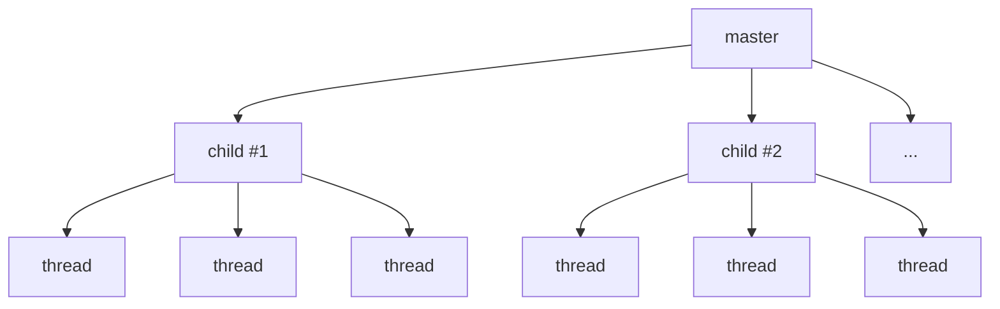

各 child プロセスが N 本のスレッドを持ち，スレッドプールで accept します．プロセス × スレッドのハイブリッドで，メモリ効率は prefork より良いものの，1 スレッド = 1 接続を block する基本構造は変わりません．

- **メリット**: prefork より省メモリ，同時接続数を伸ばしやすい．プロセス分離もそこそこ確保される
- **デメリット**: モジュールが thread-safe でなければならない (mod_php は使えない)．keep-alive で idle なスレッドが座席を占有する問題は残る
- **向くワークロード**: thread-safe な動的モジュール (mod_proxy，mod_lua) や軽い静的配信．keep-alive の比率が低めの API バックエンド

#### event MPM

worker MPM の **keep-alive 占有問題** を解決するのが event MPM (Apache 2.4 でデフォルトに昇格) です．

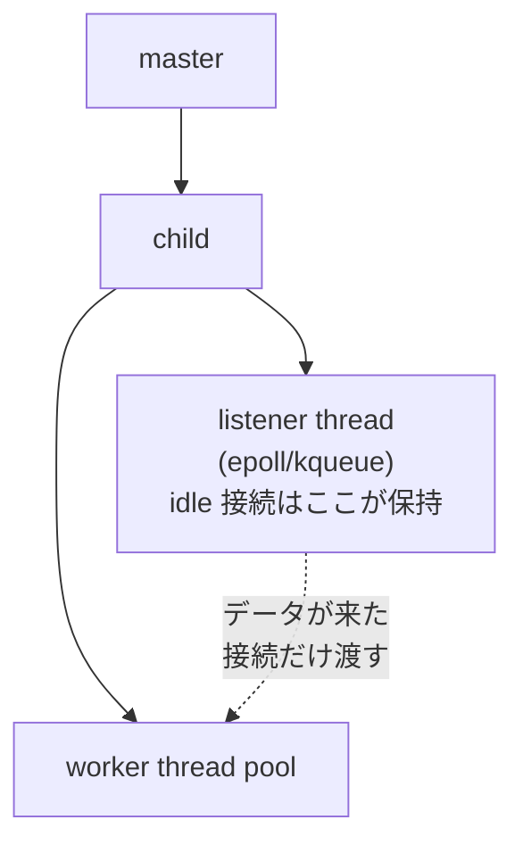

各 child に **listener スレッド** が 1 本いて epoll/kqueue で全接続を見張り，新規データが届いた接続だけを worker thread pool に渡します．keep-alive で何もしていない接続はスレッドを占有しません．

- **メリット**: keep-alive 接続を効率的に保持．ワーカースレッドが詰まりにくい．Apache のモジュール資産を活かしながら C10K に近いところまでスケール
- **デメリット**: 内部構造が複雑で，設定とトラブルシュートの難度が上がる．Nginx ほど省メモリではない
- **向くワークロード**: 既存の Apache 設定資産・モジュールを活かしつつ keep-alive の多い HTTP/1.1 トラフィックを捌きたいケース

3 つの MPM の違いは「OS のどの抽象を使うか」(プロセス / スレッド / epoll) の選択そのものです．Apache は古いモジュールエコシステムとの互換性を保ちつつ，戦略を切り替えられる柔軟性を選びました．

### Nginx

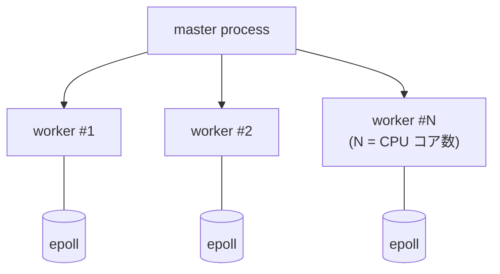

Nginx の設計はシンプルです．master プロセスが特権操作 (権限のある port の bind，ログファイルのオープン) を担当し，**CPU コア数と同じだけの worker** をそれぞれイベントループとして走らせます．各 worker は内部で epoll を回し，1 本のスレッドで数万接続を捌けます．

worker 間の負荷分散は伝統的に `accept_mutex` というロックで「次に accept するのは誰か」を調停していましたが，Linux 3.9 以降は **SO_REUSEPORT** に切り替えるのが推奨設定 (`listen ... reuseport;`) です．カーネルが自動で接続を分散してくれるためロック競合がなくなります．

- **メリット**: 圧倒的な省メモリと低レイテンシ．数万〜10 万同時接続を 1 ホストで捌ける．静的ファイル配信は `sendfile(2)` を使ったゼロコピーで NIC 律速まで出る．リバースプロキシとしての設定が成熟
- **デメリット**: 動的処理は外部 (FastCGI，uWSGI，アップストリーム) に逃がす前提．アプリケーションロジックを直接書きにくい (NJS や Lua で部分的には可能)．ホットリロードはできるが破壊的変更には弱い
- **向くワークロード**: 静的ファイル配信，リバースプロキシ / API ゲートウェイ，TLS 終端，ロードバランサ．CDN のオリジン．**「アプリの前に置くもの」全般**

リポジトリは [nginx/nginx](https://github.com/nginx/nginx) です．アーキテクチャの定番解説は AOSA (The Architecture of Open Source Applications) の [Nginx 章](https://aosabook.org/en/v2/nginx.html)．イベントエンジンの抽象と Linux 用 epoll 実装は https://github.com/nginx/nginx/blob/master/src/event/ngx_event.c と https://github.com/nginx/nginx/blob/master/src/event/modules/ngx_epoll_module.c にあります．

### Node.js / libuv

Node.js は V8 (JavaScript エンジン) と **libuv** (I/O ライブラリ) の組み合わせです．「Node.js のシングルスレッドイベントループ」の正体は libuv のイベントループです．libuv のイベントループは固定された **6 つのフェーズ** を順番に回ります．

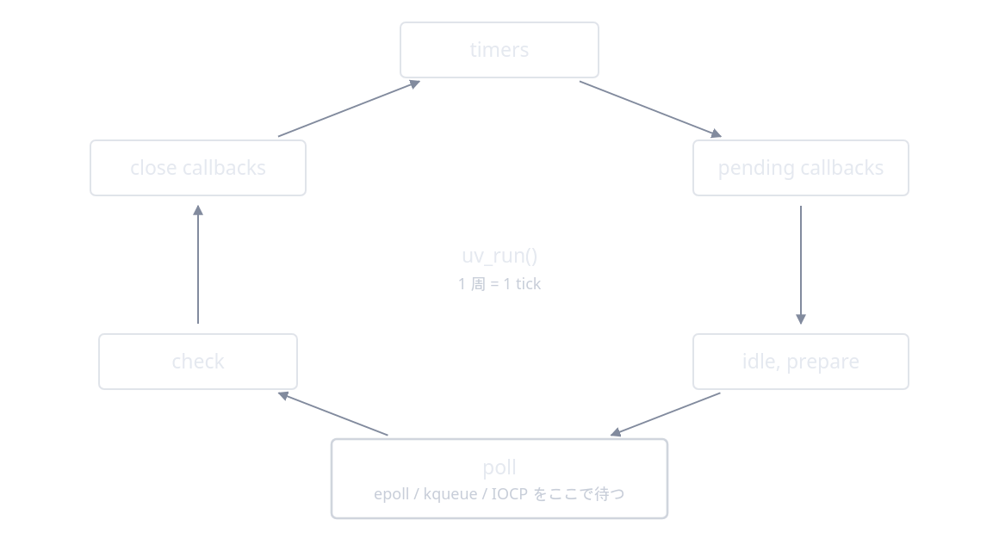

アプリケーションから見て主要な 4 つは次の通りです (残りの pending callbacks と idle, prepare は libuv 内部用です)．

- **timers**: `setTimeout` / `setInterval` のコールバック
- **poll**: epoll/kqueue/IOCP を呼んで新しい I/O イベントを待つ．多くの時間がここ
- **check**: `setImmediate` のコールバック
- **close callbacks**: `socket.on('close', ...)` など

イベントループをブロックしうる仕事 (zlib 圧縮，一部の crypto，ファイル I/O など) はメインループから **内部スレッドプール** (`UV_THREADPOOL_SIZE`，デフォルト 4) に流されます．JavaScript 側からは callback や Promise として返ってきます．Node.js 10.5+ で利用可能な `worker_threads` を使えば，アプリケーション側でも本物の OS スレッドを立てられます．それぞれが独立した V8 isolate と libuv イベントループを持ち，`MessagePort` で通信します．

- **メリット**: フロントエンドと同じ JavaScript/TypeScript で書ける．非同期 I/O が言語と標準ライブラリに統合されていて学習コストが低い．NPM の巨大エコシステム．軽量で起動が速いので FaaS と相性が良い
- **デメリット**: シングルスレッドゆえ **CPU バウンドな処理が 1 つでも詰まるとイベントループ全体が止まる**．複数 CPU を使うには `cluster` モジュールや別プロセスに頼る．重い計算や同期 I/O は鬼門
- **向くワークロード**: I/O バウンドな API サーバ，BFF (Backend for Frontend)，WebSocket / SSE のリアルタイムサーバ，CRUD 中心のサービス．リクエストごとの計算量が小さく，DB やキャッシュに広く問い合わせるタイプ

リポジトリは [libuv/libuv](https://github.com/libuv/libuv) です．設計ドキュメントが秀逸で，イベントループの正確な振る舞いを学ぶなら [libuv の Design overview](https://docs.libuv.org/en/v1.x/design.html) が第一です．Linux 用イベント実装は https://github.com/libuv/libuv/blob/v1.x/src/unix/linux.c にあります．

### Go の net/http と goroutine

Go は **1 リクエスト = 1 goroutine** を文字通りやります．100 万 goroutine を立てても破綻しないのは，ランタイムが OS スレッドの上に goroutine を多重化しているからです．スケジューラには 3 つの主役がいます．

- **G (Goroutine)**: ユーザコードの軽量スレッド
- **M (Machine)**: OS スレッド (`pthread`)
- **P (Processor)**: スケジューリングコンテキスト．数は `GOMAXPROCS` で決まり，既定値は CPU コア数 (Go 1.25 以降は cgroup の CPU 帯域制限も考慮され，コンテナでは制限値のほうが採用されます)

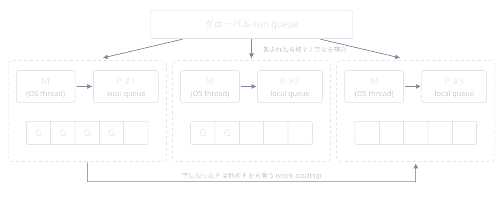

各 P がローカルの run queue を持ち，M (OS スレッド) がそこから goroutine を取り出して実行します．自分のキューが空になった P は他の P から **work-stealing** でタスクを奪います．設計の原典は Dmitry Vyukov の "Scalable Go Scheduler Design Doc": https://golang.org/s/go11sched

Go の `net.Conn.Read()` は見た目はブロッキングですが，実装は次の流れです．

1. ノンブロッキングソケットに `read(2)` を発行
2. EAGAIN が返ってきたら，**netpoller** にこの fd を登録して，現在の goroutine を **park** する
3. M (OS スレッド) はその間に別の goroutine を実行
4. epoll で fd が ready になると，netpoller が park されていた goroutine を runnable に戻す
5. P が再度スケジュールして `read(2)` を再試行

つまり Go プログラマは「同期に書ける」のに，裏では epoll が動いています．`Serve` の中で `for { rw, _ := l.Accept(); go c.serve(...) }` というループになっており，**accept してすぐ goroutine を立てる** のが本当に基本動作です．

- **メリット**: 並行コードが同期コードのように書ける．goroutine スタックは初期 2KB なので 100 万本立てても破綻しない．静的バイナリで配布が楽．標準ライブラリだけで実用的な HTTP サーバ・クライアントが書ける
- **デメリット**: GC 一時停止 (近年は十分小さいが完全にゼロではない)．ランタイムのオーバヘッド (数 MB)．一部のシステムプログラミング (リアルタイム要求，厳密なメモリ制御) には向かない．C ライブラリとの連携は cgo で重くなりがち
- **向くワークロード**: マイクロサービス・API サーバ全般，gRPC サーバ，ネットワークプロキシ (Caddy，Traefik，Cloudflare の多くのコンポーネント)，CLI ツール．**「I/O も CPU もそこそこ使う中規模サービス」のスイートスポット**

以下，資料がかなり読みやすいです．

リポジトリと一次資料: https://github.com/golang/go
netpoller の Linux 実装: https://github.com/golang/go/blob/master/src/runtime/netpoll_epoll.go
HTTP サーバ: https://github.com/golang/go/blob/master/src/net/http/server.go
スケジューラの内部については Ardan Labs の連載: https://www.ardanlabs.com/blog/2018/08/scheduling-in-go-part1.html

### 比較してどう選ぶか

ざっくり次のように整理できます．これは厳密な処方箋というより，何かを選ぶときの最初の足場として見てください．

| ユースケース                                      | 第一候補       | 理由                                 |
| ------------------------------------------------- | -------------- | ------------------------------------ |
| 静的ファイル / リバースプロキシ / TLS 終端        | Nginx          | 省メモリ，sendfile，設定が成熟       |
| API ゲートウェイ / サービスメッシュデータプレーン | Envoy or Nginx | xDS, hot restart，多数接続           |
| マイクロサービス API (中規模)                     | Go             | 並行性が書きやすく，起動も速い       |
| BFF / リアルタイム / CRUD API                     | Node.js        | フロントと同言語，I/O バウンドに強い |
| 重い CPU バウンド処理を含むサービス               | Go (or JVM)    | GC 含めて並列計算が効く              |
| 既存 mod_php や mod_perl 資産がある               | Apache prefork | 互換性を犠牲にしない                 |

「**まず Nginx を前段に置き，アプリ層は言語と組織のスキルで選ぶ**」というのが多くの現場の最大公約数です．

## CPU へのタスクの振り方とスタックの確保

### スケジューラ視点

runqueue とロードバランスの仕組みは [カーネルスケジューラ](#カーネルスケジューラ) の節で見たとおりです．ユーザランドからの主な制御を並べます．

- `taskset -c 0,1 ./server`: 起動時に CPU 0，1 にアフィニティを設定 (プログラム内なら `sched_setaffinity(2)`)
- `nice` / `renice`: 優先度 (-20 〜 +19) を変更，CFS/EEVDF の重みに反映
- `chrt`: リアルタイムスケジューリングポリシ (SCHED_FIFO, SCHED_RR) を設定

NUMA マシンではメモリも CPU ノードに紐づいているため `numactl` も登場します．関連の包括的な資料は https://www.kernel.org/doc/html/latest/scheduler/index.html にあります．

### スタックの確保

**ユーザスタック**:

- メインスレッドはプロセス起動時にカーネルが，追加スレッドは `pthread_create(3)` 時に **glibc が `mmap(2)` で確保** (デフォルトの 8MB と `pthread_attr_setstacksize(3)` は前述のとおり)
- スタック末尾には **ガードページ** (アクセスすると SIGSEGV) があり，静かなスタックオーバーフローを防ぐ

**カーネルスタック**: カーネルが各タスクのために確保するスタック．Linux x86_64 ではコンパイル時に固定 (典型的には 16KB = 4 ページ，`THREAD_SIZE` で定義)．カーネル内では再帰禁止・大きな配列禁止など厳しい制約があります．

**goroutine の伸縮スタック**: Go では OS スレッドのスタック != goroutine のスタックです．goroutine のスタックは **初期 2KB** で，足りなくなるとより大きな領域に丸ごと引っ越します (Go 1.3 からの contiguous stack 方式で，初期 2KB になったのは 1.4 から)．関数呼び出しの prologue で「スタックが足りるか」をチェックする命令が挿入されています．

OS スレッドの 8MB と goroutine の 2KB．これだけで「同じハードウェアで何接続まで詰め込めるか」が桁単位で変わります．これが Go の高並行性の物理的な根拠です．

## パフォーマンスを支える OS 機能

ここまで見てきたサーバはどれも，自分の力だけで速くなっているわけではありません．OS とハードウェアが用意した機能を上手に呼ぶことで初めて高い性能が出ます．代表的なものを並べます．

### ゼロコピー: sendfile / splice

通常のファイル送信は `read(2)` と `write(2)` でユーザ空間を往復し，途中で 2 回のコピーが発生します．`sendfile(2)` を使うと **ユーザ空間を経由せず** に送れます．

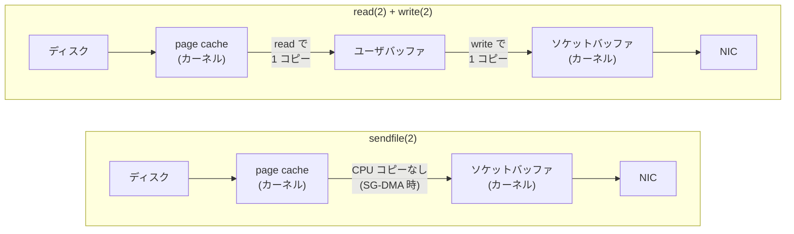

Nginx の `sendfile on;` はこれを使って静的ファイル配信を高速化しています．`splice(2)` はパイプを経由した汎用ゼロコピーで，プロキシなどで「ソケット → ソケット」を転送するのに使えます．

### SO_REUSEPORT

[並行モデルの節](#並行モデルのバリエーション) で触れたとおり，同じ `(IP, port)` を複数の listen ソケットで bind してカーネルに新規接続を分散させる機能です (Linux 3.9+，同じ uid のプロセス間に限る)．worker プロセスごとに listen ソケットを持たせれば，accept ロックなしでスケールします．

### TCP のチューニング

| パラメータ     | 効果                                                  |
| -------------- | ----------------------------------------------------- |
| `TCP_NODELAY`  | Nagle アルゴリズムを無効化，小さなパケットを即送信    |
| `TCP_CORK`     | 逆に明示的に「コルク」して送信をまとめる (Linux 拡張) |
| `TCP_FASTOPEN` | SYN にデータを乗せて RTT を 1 つ削減 (RFC 7413)       |
| `SO_KEEPALIVE` | 一定時間アイドルな接続にプローブを送って死活確認      |

`net.ipv4.tcp_*` の sysctl も並べると 1 章書けますが，重要なのは「**書き換える前に現状の挙動を測る**」ことです．デフォルト値はワークロードを問わず無難に動くよう調整されています．man の `tcp(7)` がチューニングの一次資料として詳しいです．

### NIC まわり

- **割り込み合体 (interrupt coalescing)**: NIC が「N パケットまたは T マイクロ秒ごとにまとめて割り込む」設定．高負荷時の CPU 使用率を下げる
- **NAPI**: 割り込みとポーリングのハイブリッド．高トラフィック時はポーリングに切り替える
- **RSS (Receive Side Scaling)**: NIC のハードウェア機能．パケットのフロー (4-tuple ハッシュ) ごとに別の受信キューに振り分け，別の CPU に割り込む．マルチキュー NIC が前提
- **RPS / RFS**: ソフトウェアでの分散．RFS はアプリが動いている CPU に揃える

これらが効くと「NIC 受信の段階で適切な CPU にパケットが届く」状態になり，キャッシュ局所性が改善します．Linux の scaling 文書がまとまっています: https://www.kernel.org/doc/html/latest/networking/scaling.html

### eBPF / XDP

カーネル内に検証済みの小さなプログラムを差し込める仕組み．**XDP** は NIC ドライバの一番手前でパケットを処理でき，ロードバランサや DDoS 防御の高速化に使われます (Cloudflare の L4 LB [Unimog](https://blog.cloudflare.com/unimog-cloudflares-edge-load-balancer/)，Facebook の [Katran](https://github.com/facebookincubator/katran))．

カーネルバイパス (DPDK) ほど過激ではなく，普通の Linux ネットワークスタックの上で動かせるのが eBPF/XDP の魅力です．Web サーバ本体ではなくその前段で活躍することが多いですが，「Web サーバの周辺技術」として知っておく価値があります．eBPF 全般の入門は https://ebpf.io/ が良い起点です．

## まとめ

ここまで，NIC ドライバの少し上から Web アプリケーションランタイムまでを縦に貫いて見てきました．並べてみると，各実装は **OS が提供する抽象のうち何を選び，何を隠すか** で性格が決まっていることが分かります．

- **Apache prefork**: プロセスの独立性と互換性を取り，スループットを犠牲にした
- **Apache event / Nginx**: epoll を抱きしめ，イベントループ + 複数 worker でスケールさせた
- **Node.js**: シングルスレッド + libuv で「JS の上での非同期」を最優先，CPU 並列は外側 (cluster，worker_threads，別プロセス) に逃がす
- **Go**: epoll をランタイムに隠蔽し，開発者には「同期に見えるが大量に立てて良い軽量スレッド」を提供した

どれも正解であり，ワークロードによって向き不向きがあります．
運用中のサーバで `ss`，`vmstat`，`perf` を眺めるときは，まず見るべき問いを具体化できることが重要です．
たとえば「このプロセスは accept queue から取り出すスピードが追いついているか?」「コンテキストスイッチが多すぎないか?」を見ることです．
さらに「fd はどれくらい掴んでいて，ソケットバッファをどれだけ使っているか?」「epoll を回しているのは何スレッドか?」「経路の MTU は揃っているか?」といった観点もあります．

私はこういったところまで理解したうえで，アーキテクチャを語れるエンジニアとして貢献したい．
